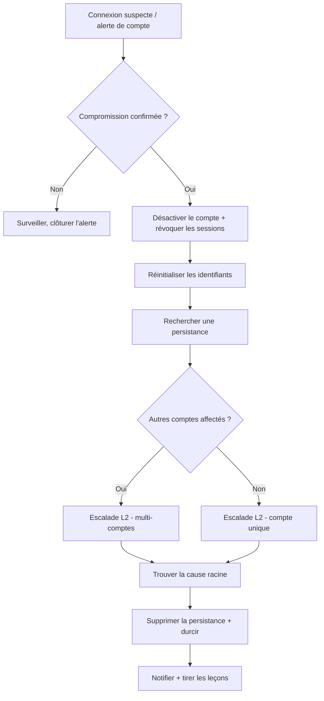

# Compromission de compte

**Statut :** 0.1 (brouillon)
{: .irf-status }

---

## 1. Critères de déclenchement

Ouvrez ce runbook dès que l'un de ces signaux apparaît, seul ou combiné :

- Une alerte de connexion ou un score de risque se déclenche pour une activité anormale : nouveau pays, nouvel appareil, déplacement impossible entre deux connexions, ou connexion depuis une IP connue comme malveillante.
- Un utilisateur signale une demande MFA qu'il n'a pas initiée, ou une notification de réinitialisation de mot de passe qu'il n'a pas demandée.
- Une alerte SIEM, pare-feu ou fournisseur d'identité montre un grand nombre de connexions échouées sur un ou plusieurs comptes en peu de temps (motif de password spray).
- Un utilisateur signale avoir reçu un email suspect peu avant de remarquer un comportement anormal sur son compte.
- Des règles de transfert de messagerie, des règles de transport, ou un accès délégué à une boîte aux lettres apparaissent sans qu'aucun administrateur ne les ait configurés.
- Une alerte se déclenche pour une « application à risque », ou un octroi de consentement OAuth inattendu apparaît dans le journal d'audit.
- Des données semblent quitter la boîte aux lettres ou le stockage de fichiers d'un compte à un volume ou à une heure inhabituels.

## 2. Objectifs de temps

- **L1 :** contenir le(s) compte(s) affecté(s) en < 30 min après déclenchement.
- **L2 :** achever l'éradication en < 4 h après confinement.

Ce sont des cibles opérationnelles internes à challenger avec des données d'incidents réels — pas des délais réglementaires.

## 3. Arbre de décision

## 4. Actions L1

1. **Confirmez la compromission.** Recoupez l'alerte avec les journaux de connexion/audit à la recherche d'anomalies : nouveau pays, nouvel appareil ou navigateur, déplacement impossible entre deux connexions, ou échecs MFA suivis d'un succès.
    - **Outil dédié** : détection de risque / journal de connexion de votre fournisseur d'identité (ex. Microsoft Entra ID Protection, Okta System Log).
    - **Alternative CLI / open source** : exportez et filtrez le journal de connexion via l'API/CLI gratuite de votre fournisseur d'identité (ex. `Get-MgAuditLogSignIn` via le module gratuit Microsoft Graph PowerShell) ; pour les systèmes auto-hébergés, filtrez `auth.log`/`journalctl` à la recherche de connexions répétées ou géographiquement incohérentes.

2. **Désactivez le compte et révoquez immédiatement toutes les sessions et jetons actifs.** Une simple réinitialisation de mot de passe ne met pas fin à une session déjà ouverte par l'attaquant.
    - **Outil dédié** : action « révoquer les sessions » / « bloquer la connexion » de la console d'administration du fournisseur d'identité.
    - **Alternative CLI / open source** : `Revoke-MgUserSignInSession` (module gratuit Microsoft Graph PowerShell) ou l'API de révocation de session de votre fournisseur d'identité ; pour les comptes locaux/LDAP, désactivez le compte et tuez les sessions/tickets actifs au niveau du serveur d'annuaire.

3. **Réinitialisez les identifiants du compte, et supprimez tout facteur d'authentification (méthode MFA) que vous ne reconnaissez pas.**
    - **Outil dédié** : réinitialisation des identifiants depuis la console du fournisseur d'identité.
    - **Alternative CLI / open source** : commande de réinitialisation de mot de passe de l'annuaire (ex. `Set-ADAccountPassword` pour un AD sur site) ; supprimez manuellement les méthodes MFA non reconnues dans l'enregistrement de l'utilisateur, depuis la même console.

4. **Recherchez une persistance mise en place par l'attaquant via le compte** : règles de transfert ou de boîte de réception, règles de flux de messagerie/transport, accès délégué à la boîte aux lettres, ou applications tierces (OAuth) nouvellement consenties.
    - **Outil dédié** : inspecteur de règles de la console d'administration de messagerie / inventaire des consentements d'applications.
    - **Alternative CLI / open source** : exportez les règles de boîte de réception/transport via la CLI d'administration gratuite de votre plateforme de messagerie, ou inspectez-les manuellement via l'interface web de messagerie ; pour les applications OAuth, un court script contre l'API gratuite de votre fournisseur d'identité listant les consentements accordés par l'utilisateur.

5. **Préservez les preuves.** Conservez l'email de phishing original s'il existe, les entrées exactes du journal de connexion, la liste des applications consenties et leurs permissions, et des horodatages précis.
    - **Outil dédié** : export de dossier SIEM / export du journal d'audit du fournisseur d'identité.
    - **Alternative CLI / open source** : exportez manuellement les lignes de journal pertinentes vers un fichier texte horodaté ; conservez l'email de phishing avec ses en-têtes complets intacts.

6. **Escaladez vers le L2 avec ce que vous avez** — compte(s) affecté(s), point d'entrée suspecté (phishing, password spray, octroi de consentement), et si d'autres comptes montrent le même motif.
    - **Outil dédié** : votre plateforme de gestion de cas/tickets.
    - **Alternative CLI / open source** : TheHive, ou un document d'incident partagé — ce que votre équipe utilise déjà pour la passation de dossiers.

## 5. Actions L2

1. **Déterminez le point d'entrée.** S'agit-il d'un email de phishing (vérifiez les en-têtes, l'expéditeur, les liens/pièces jointes), d'un motif de password spray/force brute (nombreuses connexions échouées sur de nombreux comptes depuis un petit nombre d'IP), d'un identifiant réutilisé/divulgué, ou d'une attaque de phishing par consentement ?
    - **Outil dédié** : recherche forensique de la passerelle de sécurité email, combinée aux détails de détection de risque de votre fournisseur d'identité.
    - **Alternative CLI / open source** : examinez manuellement les en-têtes des emails (résultats SPF/DKIM/DMARC) et corrélez les horodatages de connexions échouées et les IP sources entre comptes dans vos journaux exportés.

2. **Inventoriez chaque application tierce (OAuth)** ayant accès au compte ou à l'organisation, et les permissions accordées à chacune.
    - **Outil dédié** : console de sécurité des applications cloud / CASB.
    - **Alternative CLI / open source** : un script contre l'API gratuite de votre fournisseur d'identité (des scripts communautaires comme `Get-AzureADPSPermissions` existent pour cela) ou une revue manuelle via la page d'administration des consentements d'applications.

3. **Désactivez — ne supprimez pas — toute application présentant des permissions illégitimes ou excessives.** La supprimer peut lui permettre de revenir silencieusement si un utilisateur y consent à nouveau plus tard ; la désactiver la bloque définitivement pendant que vous terminez le cadrage.
    - **Outil dédié** : action « désactiver l'application » du fournisseur d'identité.
    - **Alternative CLI / open source** : un appel API désactivant le principal de service / l'enregistrement client OAuth de l'application.

4. **Déterminez le périmètre complet.** Quels autres comptes ont reçu le même email de phishing, partagent les mêmes IP sources de password spray, ou ont consenti à la même application malveillante ?
    - **Outil dédié** : recherche de corrélation SIEM à l'échelle de l'organisation.
    - **Alternative CLI / open source** : filtrez ou scriptez sur vos journaux exportés à la recherche du même expéditeur, des mêmes IP sources, ou du même identifiant d'application.

5. **Bloquez la ou les IP sources de l'attaquant et tout domaine d'envoi confirmé malveillant**, en traitant cela comme une mesure temporaire — les attaquants derrière un VPN ou une infrastructure cloud changent d'IP rapidement.
    - **Outil dédié** : déploiement de politique sur pare-feu / accès conditionnel.
    - **Alternative CLI / open source** : une entrée manuelle dans les ACL du pare-feu ou dans la liste de blocage de la passerelle de messagerie.

6. **Supprimez toute la persistance trouvée en L1, sur chaque compte affecté** : supprimez les règles de boîte de réception/transport malveillantes, révoquez les consentements d'applications malveillantes à l'échelle de l'organisation, et supprimez les méthodes MFA non reconnues et les accès délégués.
    - **Outil dédié** : remédiation en masse via la console d'administration ou un runbook d'automatisation.
    - **Alternative CLI / open source** : un court script répétant les mêmes étapes de suppression manuelle sur la liste des comptes affectés.

7. **Durcissez pour éviter une répétition.** Imposez le MFA sur tous les comptes s'il n'est pas déjà universel, désactivez les protocoles d'authentification hérités/basiques qui contournent le MFA, et activez des politiques de connexion basées sur le risque si votre fournisseur d'identité le permet.
    - **Outil dédié** : configuration d'accès conditionnel / politique de risque du fournisseur d'identité.
    - **Alternative CLI / open source** : pour les fournisseurs d'identité auto-hébergés, imposez le MFA au niveau de l'application ou du reverse-proxy avec une passerelle d'authentification gratuite (ex. Authelia, Keycloak), et désactivez les points d'accès aux protocoles hérités dans la configuration.

8. **Surveillez une seconde vague.** Un attaquant ayant réussi à réutiliser un identifiant phishé ou un octroi de consentement cible souvent d'autres utilisateurs de la même organisation peu après.
    - **Outil dédié** : une règle d'alerte SIEM ajustée sur les indicateurs confirmés (expéditeur, IP source, identifiant d'application).
    - **Alternative CLI / open source** : une tâche planifiée de filtrage de journaux surveillant ces mêmes indicateurs.

## 6. Notifications & escalade

> Escaladez d'abord en interne — informez votre responsable SOC/IR et la direction de ce que vous avez confirmé et de ce qui reste incertain. La décision de notifier une entité externe (CERT national, régulateur, forces de l'ordre) revient à la direction et au service juridique/DPO de votre organisation, pas à l'analyste qui répond à l'incident. Voir `finding-your-csirt.md` si votre organisation a besoin d'aide pour identifier l'organisme externe à contacter.

## 7. Erreurs à éviter

- **Réinitialiser le mot de passe sans révoquer les sessions et jetons actifs** — la session existante de l'attaquant survit à un changement de mot de passe.
- **Supprimer une application malveillante plutôt que la désactiver** — elle peut regagner silencieusement l'accès si un utilisateur y consent à nouveau plus tard.
- **Considérer un seul compte compromis comme le périmètre complet** — le password spray et le phishing par consentement sont des techniques de campagne qui visent généralement de nombreux comptes à la fois.
- **Remettre le compte en service normal avant d'avoir supprimé les règles de transfert, l'accès délégué et les méthodes MFA non reconnues** — ces éléments survivent à une réinitialisation de mot de passe et laissent l'attaquant revenir silencieusement.
- **Considérer un blocage d'IP comme un confinement durable** — les attaquants derrière un VPN ou une infrastructure cloud changent rapidement d'IP source.
- **Supposer que le MFA seul arrête un attaquant qui détient déjà un jeton de session actif ou un octroi de consentement OAuth** — aucun des deux ne nécessite de se ré-authentifier.

## 8. Ressources

- MITRE ATT&CK [T1078](https://attack.mitre.org/techniques/T1078/) — Valid Accounts.
- MITRE ATT&CK [T1110](https://attack.mitre.org/techniques/T1110/) — Brute Force (le password spray est la sous-technique T1110.003).
- MITRE ATT&CK [T1098.001](https://attack.mitre.org/techniques/T1098/001/) — Account Manipulation: Additional Cloud Credentials.
- MITRE ATT&CK [T1114.003](https://attack.mitre.org/techniques/T1114/003/) — Email Collection: Email Forwarding Rule.
- Outils cités en exemple : le module gratuit Microsoft Graph PowerShell, TheHive, MISP, des passerelles d'authentification open source comme Authelia ou Keycloak, fail2ban.

## 9. Sources d'inspiration

- Microsoft — « Phishing investigation » (Incident response playbooks) — `github.com/MicrosoftDocs/security` — CC BY 4.0 (contenu documentaire).
- Microsoft — « Password spray investigation » (Incident response playbooks) — `github.com/MicrosoftDocs/security` — CC BY 4.0.
- Microsoft — « App consent grant investigation » (Incident response playbooks) — `github.com/MicrosoftDocs/security` — CC BY 4.0.
- Microsoft — « Compromised and malicious applications investigation » (Incident response playbooks) — `github.com/MicrosoftDocs/security` — CC BY 4.0.
