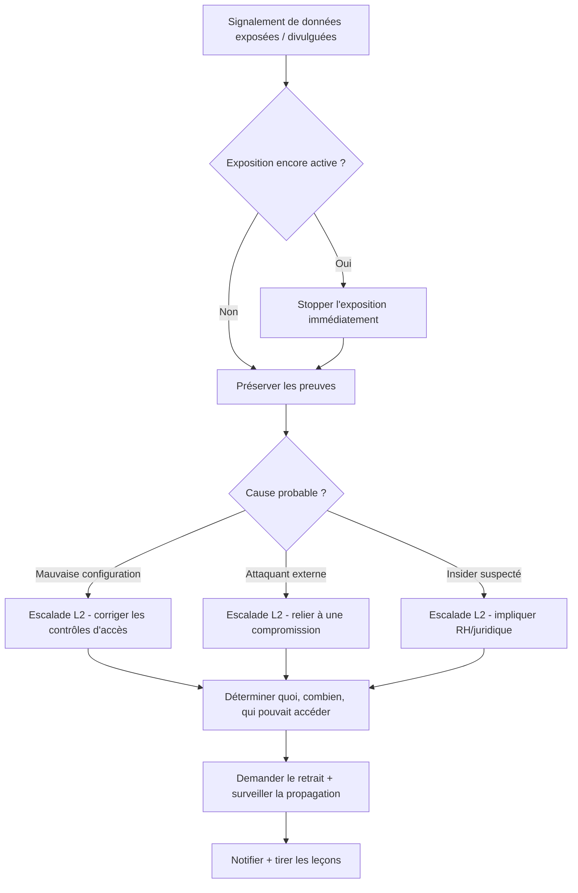

# Fuite / exposition de données

**Statut :** 0.1 (brouillon)
{: .irf-status }

---

## 1. Critères de déclenchement

Ouvrez ce runbook dès que l'un de ces signaux apparaît, seul ou combiné :

- Un outil DLP, CASB, ou un scanner de sécurité cloud alerte sur des données sensibles quittant le réseau ou se trouvant dans un emplacement accessible publiquement.
- Un bucket de stockage cloud, une base de données, un dépôt de code ou un partage de fichiers est trouvé configuré avec un accès public ou trop large.
- Un employé ou un partenaire signale avoir envoyé des fichiers sensibles au mauvais destinataire.
- Un client, un chercheur, ou un journaliste signale avoir trouvé des données de votre organisation exposées en ligne.
- Des documents ou dossiers sensibles apparaissent sur un moteur de recherche, un site de paste, un dépôt de code public, ou un forum.
- Le site de fuite d'un opérateur de ransomware mentionne votre organisation (voir `ransomware.md` si c'est le déclencheur).
- Un export ou téléchargement inhabituellement volumineux de données sensibles est enregistré peu avant l'apparition des symptômes.
- Un fournisseur ou une dépendance est trouvé avoir divulgué des données incluant celles de votre organisation (voir `supply-chain-compromise.md` si c'est le déclencheur).

## 2. Objectifs de temps

- **L1 :** stopper l'exposition en cours en < 30 min après déclenchement.
- **L2 :** achever le cadrage et le confinement de la cause racine en < 4 h.

Ce sont des cibles opérationnelles internes à challenger avec des données d'incidents réels — pas des délais réglementaires.

## 3. Arbre de décision

## 4. Actions L1

1. **Confirmez l'exposition.** Vérifiez que les données sont réelles, sensibles, et réellement accessibles — pas un faux positif ou des données de test.
    - **Outil dédié** : console d'alertes DLP/CASB.
    - **Alternative CLI / open source** : accédez vous-même à l'emplacement signalé (`curl -I <url>`, ou vérification en navigation privée) ; pour le stockage cloud, vérifiez les permissions directement via la CLI gratuite du fournisseur (`aws s3api get-bucket-acl`, `az storage container show-permission`, `gsutil iam get gs://<bucket>`).

2. **Stoppez immédiatement l'exposition en cours** — révoquez l'accès public, mettez la ressource hors ligne, ou bloquez le destinataire/l'URL, selon le cas.
    - **Outil dédié** : remédiation en un clic d'une plateforme CSPM (cloud security posture management).
    - **Alternative CLI / open source** : basculez la ressource en privé directement via la CLI gratuite du fournisseur (`aws s3api put-bucket-acl --acl private`, `az storage container set-permission --public-access off`, `gsutil iam ch -d allUsers`) ; pour un email, rappelez le message si c'est pris en charge, ou demandez immédiatement au destinataire de le supprimer.

3. **Préservez les preuves avant toute autre action destructrice.** Enregistrez les données exposées telles que trouvées — métadonnées, horodatages, URL ou chemin exact — sans télécharger plus que nécessaire pour confirmer le périmètre.
    - **Outil dédié** : capture de preuves d'incident du DLP.
    - **Alternative CLI / open source** : captures d'écran plus un `curl`/`wget` ciblé du listing ou de l'en-tête de la ressource (pas l'intégralité du jeu de données) vers un dossier de preuves sécurisé, avec horodatages enregistrés.

4. **Faites-vous une première idée de la cause probable** — mauvaise configuration, compromission externe (recherchez des comptes ou IP inconnus ayant accédé à la ressource avant la fuite), ou action d'un utilisateur légitime.
    - **Outil dédié** : corrélation de journal d'audit cloud / SIEM sur la fenêtre d'exposition.
    - **Alternative CLI / open source** : examinez manuellement les journaux d'accès de la ressource pour la période précédant la découverte (`aws s3api get-bucket-logging` plus revue des journaux, ou l'export gratuit du journal d'audit de votre plateforme).

5. **Vérifiez la même mauvaise configuration ailleurs.** Si un bucket, un partage ou un dépôt a été exposé, les ressources similaires construites depuis le même modèle le sont souvent aussi.
    - **Outil dédié** : scanner de sécurité cloud / CSPM balayant toutes les ressources.
    - **Alternative CLI / open source** : un court script bouclant sur la CLI gratuite de votre fournisseur à travers tous les buckets/conteneurs/dépôts, vérifiant les indicateurs d'accès public.

6. **Escaladez vers le L2 avec ce que vous avez** — ce qui a été exposé, depuis quand (si connu), comment cela a été trouvé, et la cause probable.
    - **Outil dédié** : votre plateforme de gestion de cas/tickets.
    - **Alternative CLI / open source** : TheHive, ou un document d'incident partagé.

## 5. Actions L2

1. **Déterminez exactement quelles données ont été exposées et leur sensibilité.** Données personnelles, identifiants, dossiers financiers, propriété intellectuelle — classifiez-les.
    - **Outil dédié** : outil de classification de données / inspection de contenu DLP.
    - **Alternative CLI / open source** : échantillonnez et filtrez le jeu de données exposé à la recherche de motifs (formats d'adresses email, séquences ressemblant à des numéros de carte) pour caractériser son contenu sans l'exfiltrer davantage vous-même.

2. **Déterminez depuis combien de temps les données étaient exposées et qui aurait pu y accéder.**
    - **Outil dédié** : analytique de journal d'audit cloud / historique d'accès CASB.
    - **Alternative CLI / open source** : exportez et filtrez les journaux d'accès bruts de la ressource pour la fenêtre d'exposition ; pour une ressource publique, vérifiez les caches des moteurs de recherche pour voir si elle a été indexée.

3. **Vérifiez si les données divulguées se sont déjà propagées** — moteurs de recherche, sites de paste, dépôts de code publics, ou un tracker de site de fuite si un groupe de ransomware est impliqué.
    - **Outil dédié** : service de surveillance threat intelligence / dark web et sites de fuite.
    - **Alternative CLI / open source** : requêtes manuelles sur moteurs de recherche pour des chaînes distinctives du jeu de données, recherche sur des sites de paste publics, et trackers gratuits de sites de fuite de ransomware le cas échéant.

4. **Si un individu précis semble être la source, impliquez les RH et le juridique avant toute action supplémentaire** — ne fouillez pas unilatéralement les fichiers ou communications privés d'un employé nommé.
    - **Outil dédié** : le processus d'escalade RH/juridique établi de votre organisation.
    - **Alternative CLI / open source** : aucune — cette étape n'a pas de substitut technique. Si une investigation plus poussée de l'activité d'un utilisateur précis est justifiée, suivez `insider-threat.md` une fois que les RH/le juridique l'ont autorisée.

5. **Si une compromission externe est la cause probable, reliez cet incident au runbook concerné et poursuivez l'éradication là-bas** plutôt que de dupliquer ce travail ici.
    - **Outil dédié** : liaison de dossiers SIEM/EDR.
    - **Alternative CLI / open source** : recoupez les mêmes IOC et la même chronologie dans votre document d'incident partagé ; suivez `account-compromise.md` ou `ransomware.md` selon le cas.

6. **Demandez le retrait de toute copie publiée publiquement.** Contactez l'hébergeur, le bureau d'enregistrement, ou le contact abus de la plateforme avec les preuves jointes.
    - **Outil dédié** : un service de protection de marque / de retrait de contenu.
    - **Alternative CLI / open source** : faites un `whois` du domaine ou de l'hébergeur vous-même et écrivez directement à leur contact abus avec l'URL, les captures d'écran, et les horodatages.

7. **Corrigez la cause racine largement, pas seulement la ressource exposée.** Corrigez le modèle de permission, la politique IAM, ou le processus sous-jacent qui a permis l'exposition, puis relancez le balayage de l'action L1 #5 sur tout l'environnement.
    - **Outil dédié** : scanner de politique infrastructure-as-code / remédiation automatique CSPM.
    - **Alternative CLI / open source** : mettez à jour le modèle de provisionnement partagé (Terraform, CloudFormation, ou votre checklist manuelle) et revérifiez manuellement chaque ressource similaire.

8. **Surveillez la propagation continue et les signes d'utilisation des données** — phishing ciblé référençant les données divulguées, ou tentatives de fraude contre les personnes exposées.
    - **Outil dédié** : flux de threat intelligence ajusté sur les indicateurs de cet incident.
    - **Alternative CLI / open source** : une requête planifiée sur moteurs de recherche/sites de paste pour des chaînes distinctives du jeu de données, poursuivie pendant plusieurs semaines.

## 6. Notifications & escalade

> Escaladez d'abord en interne — informez votre responsable SOC/IR et la direction de ce que vous avez confirmé et de ce qui reste incertain. La décision de notifier une entité externe (CERT national, régulateur, forces de l'ordre) revient à la direction et au service juridique/DPO de votre organisation, pas à l'analyste qui répond à l'incident. Voir `finding-your-csirt.md` si votre organisation a besoin d'aide pour identifier l'organisme externe à contacter.

## 7. Erreurs à éviter

- **Télécharger ou copier plus de données exposées que nécessaire pour confirmer le périmètre** — chaque copie supplémentaire est un endroit de plus d'où elles pourraient à nouveau fuiter.
- **Corriger la seule ressource exposée sans vérifier la même mauvaise configuration ailleurs** — les ressources similaires construites depuis le même modèle partagent souvent la même erreur.
- **Supposer qu'une demande de retrait élimine le risque** — une fois des données publiques, considérez qu'elles ont déjà été copiées ; le retrait réduit la propagation future, il n'annule pas ce qui s'est déjà passé.
- **Fouiller les fichiers ou communications privés d'un employé suspecté sans l'accord préalable des RH/du juridique** — cela peut être illégal selon la juridiction et peut entacher toute action ultérieure.
- **Considérer « on ne trouve pas où les données sont allées » comme une preuve qu'elles n'ont pas été consultées** — l'absence de journaux d'accès ne signifie pas l'absence d'accès, surtout pour une ressource publique sans journalisation activée.
- **Attendre une vision complète de la cause avant de stopper l'exposition** — restreindre l'accès d'abord, investiguer la cause ensuite, presque toujours dans cet ordre.

## 8. Ressources

- MITRE ATT&CK [T1530](https://attack.mitre.org/techniques/T1530/) — Data from Cloud Storage.
- MITRE ATT&CK [T1567](https://attack.mitre.org/techniques/T1567/) — Exfiltration Over Web Service.
- MITRE ATT&CK [T1213](https://attack.mitre.org/techniques/T1213/) — Data from Information Repositories.
- Outils cités en exemple : AWS CLI, Azure CLI, et `gcloud`/`gsutil` (tous gratuits), Aleph (outil open source pour investiguer des jeux de documents divulgués), TheHive, MISP.

## 9. Sources d'inspiration

- CERT Société Générale — IRM #11 « Information Leakage » (v2.0) — `github.com/certsocietegenerale/IRM` — CC BY 3.0 Unported.
- CERT aDvens — IRM-11 « Fuite de données » (2025-10-27) — `github.com/cert-advens/IRM` — CC BY 3.0 Unported.
