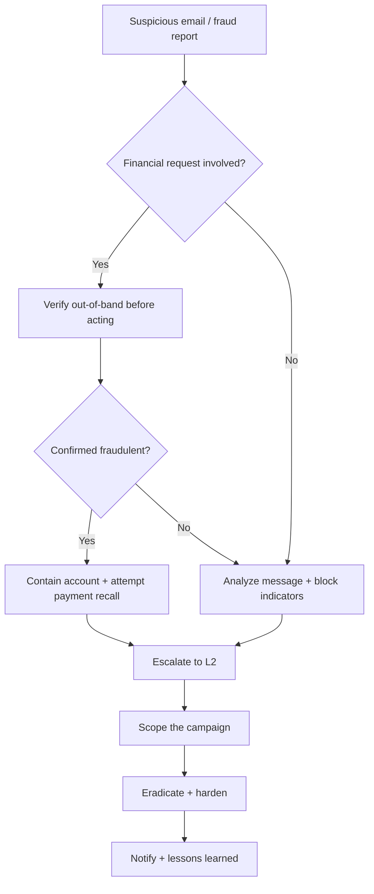

# Phishing / Compromission de messagerie professionnelle (BEC)

**Statut :** 0.1 (brouillon)

---

## 1. Critères de déclenchement

Ouvrez ce runbook dès que l'un de ces signaux apparaît, seul ou combiné :

- Un utilisateur signale un email suspect, ou un outil de sécurité de messagerie en signale un (piège à spam, flux de threat intelligence, correspondance avec un annuaire de phishing).
- Un email demande un virement, une modification des coordonnées bancaires/de paiement, ou des informations sensibles — en particulier avec un ton urgent ou confidentiel.
- Le ton, le langage ou la mise en forme d'un email dévie de la façon dont un contact connu ou un dirigeant écrit habituellement.
- Plusieurs utilisateurs reçoivent des messages suspects quasi identiques en peu de temps.
- Une nouvelle règle de boîte de réception apparaît, transférant ou supprimant automatiquement des messages, sans que personne ne l'ait configurée.
- Un membre de l'équipe finance ou comptabilité fournisseurs signale une demande inhabituelle de modification de paiement fournisseur.
- Les logs web montrent un trafic inattendu vers un domaine usurpant votre marque, ou un annuaire de phishing surveillé liste votre organisation comme cible.

## 2. Objectifs de temps

- **L1 :** contenir le(s) compte(s)/message(s) affecté(s) en < 30 min après déclenchement.
- **L2 :** achever l'éradication en < 4 h après confinement.

Ce sont des cibles opérationnelles internes à challenger avec des données d'incidents réels — pas des délais réglementaires. Remarque : si un virement frauduleux est en jeu, la fenêtre pour demander un rappel bancaire se compte en heures, pas en jours — traitez cette étape spécifique comme plus urgente que les objectifs généraux ci-dessus.

## 3. Arbre de décision

## 4. Actions L1

1. **Confirmez le signalement.** Récupérez le message suspect lui-même — en-têtes, corps, pièces jointes, liens — sans ouvrir de pièce jointe ni suivre de lien depuis un appareil ayant accès à des données sensibles ou des identifiants.
   - **Outil dédié** : trace des messages / vue de mise en quarantaine de la passerelle de sécurité email.
   - **Alternative CLI / open source** : exportez le message brut (`.eml`) via « afficher la source » / « télécharger le message » dans le client de messagerie, et examinez-le hors ligne sur une machine isolée.

2. **Si une demande financière est en jeu (virement, modification de coordonnées de paiement, cartes-cadeaux), vérifiez-la hors bande avant d'agir** — appelez le demandeur à un numéro déjà enregistré, jamais celui fourni dans le message.
   - **Outil dédié** : un annuaire de contacts fournisseurs/dirigeants préétabli dans votre système financier.
   - **Alternative CLI / open source** : une liste de contacts partagée, hors ligne (tableur ou fiche imprimée), maintenue en dehors de la messagerie.

3. **Si un virement a déjà été effectué, contactez immédiatement votre banque ou prestataire de paiement pour demander un rappel ou un blocage.** La rapidité compte ici plus que presque partout ailleurs dans ce projet — les fenêtres de rappel se ferment en quelques heures.
   - **Outil dédié** : la hotline fraude/litige de votre banque ou son portail de signalement de fraude en ligne.
   - **Alternative CLI / open source** : il n'existe pas d'alternative CLI à un appel à votre banque — faites-le immédiatement, et confirmez par écrit ensuite pour la traçabilité.

4. **Identifiez qui d'autre a reçu le même message**, et si quelqu'un a cliqué sur un lien, ouvert une pièce jointe, ou saisi des identifiants.
   - **Outil dédié** : recherche « qui a reçu ceci » de la passerelle de sécurité email, ou corrélation SIEM.
   - **Alternative CLI / open source** : recherchez dans les logs de votre serveur de messagerie le même expéditeur, sujet, ou identifiant de message à travers les boîtes aux lettres.

5. **Confinez tout compte ayant saisi des identifiants ou montrant des signes de compromission** : désactivez-le, révoquez les sessions actives, et réinitialisez son mot de passe — voir `runbooks/account-compromise.md` pour la procédure complète.
   - **Outil dédié** : console d'administration du fournisseur d'identité.
   - **Alternative CLI / open source** : les mêmes commandes gratuites que dans le runbook Compromission de compte (ex. `Disable-ADAccount`, `Revoke-MgUserSignInSession`).

6. **Bloquez l'expéditeur et tout domaine, lien ou pièce jointe malveillants trouvés**, et supprimez le message des autres boîtes de réception si possible.
   - **Outil dédié** : déploiement de politique de la passerelle de sécurité email.
   - **Alternative CLI / open source** : une règle côté serveur de messagerie bloquant l'expéditeur/le sujet, ou un script supprimant le message via la CLI d'administration gratuite de votre plateforme de messagerie.

7. **Escaladez vers le L2 avec ce que vous avez** — le message lui-même, qui a été ciblé, et si des identifiants ou de l'argent ont été compromis.
   - **Outil dédié** : votre plateforme de gestion de cas/tickets.
   - **Alternative CLI / open source** : TheHive, ou un document d'incident partagé.

## 5. Actions L2

1. **Analysez le message et toute pièce jointe/lien dans un environnement isolé ou sandboxé.** Vérifiez les en-têtes (résultats SPF/DKIM/DMARC, serveur d'origine) et soumettez liens/pièces jointes/hashs à un service d'analyse.
   - **Outil dédié** : sandbox d'entreprise / plateforme de threat intelligence.
   - **Alternative CLI / open source** : soumettez hashs et URL à VirusTotal, ou détonnez les pièces jointes dans une sandbox gratuite comme Cuckoo ou une VM jetable.

2. **Déterminez le type de campagne** — collecte d'identifiants, diffusion de malware, ou tentative de fraude BEC — et si elle est ciblée ou opportuniste.
   - **Outil dédié** : corrélation de la plateforme de threat intelligence avec des campagnes connues.
   - **Alternative CLI / open source** : vérifiez manuellement le message dans un annuaire public de phishing comme PhishTank ou Google Safe Browsing.

3. **Auditez les règles de boîte de réception et l'accès délégué** de chaque compte ayant reçu le message ou montrant des signes de compromission, à la recherche de règles de transfert ou de suppression automatique plantées par l'attaquant.
   - **Outil dédié** : inspecteur de règles de la console d'administration de messagerie.
   - **Alternative CLI / open source** : exportez les règles de boîte de réception/transport via la CLI d'administration gratuite de votre plateforme de messagerie, comme dans `runbooks/account-compromise.md`.

4. **Déterminez le périmètre complet** : nombre total d'utilisateurs ciblés et affectés, services impliqués, et exposition financière totale si une tentative de fraude a réussi.
   - **Outil dédié** : recherche de corrélation SIEM à l'échelle de l'organisation.
   - **Alternative CLI / open source** : filtrez ou scriptez sur les logs de messagerie et d'authentification exportés à la recherche du même expéditeur, des mêmes liens, ou du même identifiant de message.

5. **Si un contenu frauduleux est hébergé en ligne** (page de connexion usurpée, portail de facture frauduleux), identifiez son hébergeur et son bureau d'enregistrement, et déposez une demande d'abus/retrait avec les preuves jointes (en-têtes, captures d'écran, horodatages).
   - **Outil dédié** : un service de protection de marque / de retrait de contenu.
   - **Alternative CLI / open source** : faites un `whois` du domaine vous-même, prenez une copie horodatée de la page avec un outil gratuit comme HTTrack, et écrivez directement au contact abus de l'hébergeur.

6. **Durcissez l'authentification email et les défenses de la messagerie.** Confirmez que SPF, DKIM et DMARC sont correctement configurés, désactivez les protocoles d'authentification hérités qui contournent le MFA, et resserrez les filtres selon les indicateurs trouvés.
   - **Outil dédié** : configuration de politique de la passerelle de sécurité email.
   - **Alternative CLI / open source** : publiez ou ajustez vous-même vos enregistrements DNS SPF/DMARC (gratuit, DNS standard) et vérifiez qu'ils résolvent correctement avec `dig txt` et un vérificateur DMARC gratuit en ligne.

7. **Si de l'argent a été transféré, travaillez avec la finance pour documenter la perte** et ajoutez une friction temporaire au processus de paiement — vérification hors bande, second validateur — jusqu'à confirmation que la faille de contrôle sous-jacente est corrigée.
   - **Outil dédié** : configuration du workflow du système finance/ERP.
   - **Alternative CLI / open source** : une checklist appliquée manuellement exigeant un rappel téléphonique avant toute modification de coordonnées de paiement, jusqu'au rétablissement du contrôle automatisé.

8. **Surveillez une seconde vague ou une nouvelle tentative contre la même cible.** Les tentatives de BEC réussies sont fréquemment suivies d'une seconde demande, plus urgente, dans les jours qui suivent.
   - **Outil dédié** : une règle d'alerte SIEM ajustée sur les indicateurs confirmés (expéditeur, domaine, motif du message).
   - **Alternative CLI / open source** : une tâche planifiée de filtrage de journaux surveillant ces mêmes indicateurs.

## 6. Notifications & escalade

> Notifiez votre autorité compétente (CERT national, DPO, régulateur) selon la réglementation applicable à votre juridiction — consultez votre conseil juridique. Voir `finding-your-csirt.md` pour identifier qui contacter.

## 7. Erreurs à éviter

- **Appeler le numéro de téléphone ou répondre à l'adresse email fournie dans le message suspect pour « vérifier »** — cela ne fait que confirmer vos informations à l'attaquant. Utilisez toujours un numéro ou une adresse déjà enregistrés.
- **Attendre que l'investigation interne soit « plus avancée » avant de contacter la banque** — les fenêtres de rappel de paiement se ferment en heures, pas en jours.
- **Considérer un seul email signalé comme le périmètre complet** — les campagnes de phishing et de BEC ciblent généralement de nombreux utilisateurs de la même organisation à la fois.
- **Corriger le compte compromis sans vérifier les règles de boîte de réception ou l'accès délégué plantés par l'attaquant** — ceux-ci survivent à une réinitialisation de mot de passe.
- **Supposer qu'un email bien écrit et sans faute ne peut pas être du phishing** — les messages de BEC en particulier sont souvent soigneusement conçus pour imiter exactement le ton d'un dirigeant.
- **Sauter la vérification hors bande parce que la demande « semble urgente »** — l'urgence est l'outil principal de l'attaquant, pas une raison de sauter la vérification.

## 8. Ressources

- MITRE ATT&CK [T1566](https://attack.mitre.org/techniques/T1566/) — Phishing (T1566.001 Spearphishing Attachment, T1566.002 Spearphishing Link).
- MITRE ATT&CK [T1114.003](https://attack.mitre.org/techniques/T1114/003/) — Email Collection: Email Forwarding Rule.
- MITRE ATT&CK [T1585.002](https://attack.mitre.org/techniques/T1585/002/) — Establish Accounts: Email Accounts.
- Outils cités en exemple : VirusTotal, PhishTank, Cuckoo Sandbox, Hybrid Analysis, HTTrack, TheHive, MISP.

## 9. Sources d'inspiration

- CERT Société Générale — IRM #16 « Phishing » (v2.0) — `github.com/certsocietegenerale/IRM` — CC BY 3.0 Unported.
- CERT Société Générale — IRM #22 « Business Email Compromise » (v1.0) — `github.com/certsocietegenerale/IRM` — CC BY 3.0 Unported.
- Counteractive — « Playbook: Phishing » — `github.com/counteractive/incident-response-plan-template` — Apache License 2.0.
