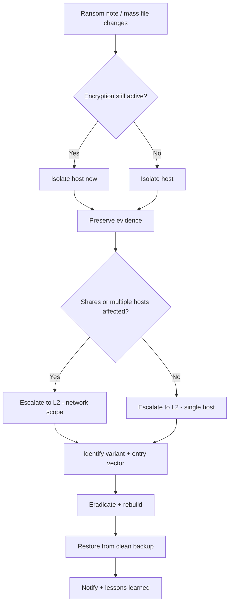

# Ransomware

**Statut :** 0.1 (brouillon)

---

## 1. Critères de déclenchement

Ouvrez ce runbook dès que l'un de ces signaux apparaît, seul ou combiné :

- Une note de rançon ou un message à l'écran demandant un paiement apparaît sur le bureau d'un utilisateur ou dans des dossiers affectés.
- Des fichiers deviennent inaccessibles ou corrompus, souvent renommés avec une extension inhabituelle (ex. `.abc`, `.xyz`, `.locked`).
- Un grand nombre de fichiers sont modifiés en très peu de temps sur un poste ou un partage réseau.
- Une alerte EDR, une détection antivirus ou une règle de corrélation SIEM se déclenche sur un comportement évoquant un chiffrement.
- Des utilisateurs signalent des emails professionnels inhabituels (souvent déguisés en factures) avec pièces jointes, peu avant l'apparition des symptômes.
- Des connexions sortantes inhabituelles sont observées — passerelles Tor, adresses Tor/I2P, ou sites de paiement en cryptomonnaie.
- Des comptes à privilèges montrent des connexions ou des mouvements latéraux à des heures inhabituelles, juste avant les symptômes.
- Le site de fuite ou un forum d'un opérateur de ransomware mentionne votre organisation.

## 2. Objectifs de temps

- **L1 :** contenir le(s) poste(s) affecté(s) en < 30 min après déclenchement.
- **L2 :** achever l'éradication en < 4 h après confinement.

Ce sont des cibles opérationnelles internes à challenger avec des données d'incidents réels — pas des délais réglementaires.

## 3. Arbre de décision

## 4. Actions L1

1. **Confirmez les signes.** Vérifiez la présence d'une note de rançon, d'extensions de fichiers inhabituelles, de modifications massives de fichiers en peu de temps, ou d'une alerte EDR/SIEM liée à un comportement de chiffrement.
   - **Outil dédié** : console d'alertes EDR/SIEM — partez de la détection déclenchante.
   - **Alternative CLI / open source** : inspectez directement le bureau et les dossiers affectés ; sous Windows, `Get-ChildItem -Recurse -Path <partage> | Sort-Object LastWriteTime -Descending | Select-Object -First 50` pour repérer les modifications massives récentes ; sous Linux, `find /chemin -mmin -15 -type f`.

2. **Isolez immédiatement le(s) poste(s) affecté(s) du réseau — ne les éteignez pas.** Éteindre détruit les preuves volatiles en mémoire et peut déclencher des routines destructrices chez certaines familles de ransomware.
   - **Outil dédié** : action d'isolation réseau / mise en quarantaine de l'EDR.
   - **Alternative CLI / open source** : désactivez la carte réseau (`netsh interface set interface "<nom>" admin=disable` sous Windows, `ip link set <iface> down` sous Linux) ou débranchez physiquement le câble réseau ; laissez la machine allumée.

3. **Protégez les partages réseau et les sauvegardes avant qu'ils ne soient chiffrés à leur tour.** Déconnectez ou verrouillez les partages accessibles depuis le poste affecté, même ceux ne montrant pas encore de symptômes.
   - **Outil dédié** : fonction de verrouillage des partages de la plateforme de stockage, ou protection des partages intégrée à l'EDR.
   - **Alternative CLI / open source** : `net use x: \\unc\chemin\ /DELETE` pour supprimer les lecteurs mappés depuis le poste affecté, ou désactivez le partage directement depuis la console du serveur de fichiers.

4. **Préservez les preuves avant toute autre action destructrice.** Photographiez la note de rançon et tout message à l'écran, notez l'extension et le motif de nommage des fichiers chiffrés, et enregistrez les horodatages exacts.
   - **Outil dédié** : capture forensique / collecte de triage de l'EDR.
   - **Alternative CLI / open source** : une photo du smartphone de l'écran, plus une capture mémoire avec un outil d'imagerie gratuit (ex. compatible Volatility) si cela ne retarde pas l'isolation.

5. **Désactivez les comptes montrant des signes de compromission** — en particulier les comptes à privilèges utilisés à des heures inhabituelles, ou créés au moment de l'incident.
   - **Outil dédié** : désactivation en masse de comptes depuis la console IAM/PAM.
   - **Alternative CLI / open source** : `Disable-ADAccount -Identity <utilisateur>` (module PowerShell Active Directory), ou verrouillez le compte directement dans la console de votre annuaire.

6. **Escaladez vers le L2 avec ce que vous avez** — postes/utilisateurs affectés, contenu de la note de rançon, motif d'extension de fichiers, et chronologie approximative. Ne négociez pas, ne payez pas, et ne restaurez pas depuis une sauvegarde à ce stade.
   - **Outil dédié** : votre plateforme de gestion de cas/tickets.
   - **Alternative CLI / open source** : TheHive, ou un document d'incident partagé — ce que votre équipe utilise déjà pour la passation de dossiers.

## 5. Actions L2

1. **Identifiez la famille/variante de ransomware.** Utilisez le contenu de la note de rançon, l'extension des fichiers chiffrés, et le moyen de contact comme empreintes.
   - **Outil dédié** : service d'analyse d'échantillons de votre fournisseur EDR/antivirus.
   - **Alternative CLI / open source** : soumettez un fichier chiffré et la note de rançon à un service d'identification gratuit comme ID Ransomware ou le Crypto Sheriff du projet No More Ransom.

2. **Déterminez le périmètre complet.** Recherchez les mêmes indicateurs dans tout l'environnement — postes, comptes, partages.
   - **Outil dédié** : recherche d'IOC à l'échelle du parc via l'EDR.
   - **Alternative CLI / open source** : écrivez et exécutez des règles YARA sur les postes suspects, ou utilisez les logs Sysmon et les outils Sysinternals (Autoruns, Process Explorer) pour vérifier manuellement des systèmes similaires.

3. **Trouvez le vecteur d'infection** — pièce jointe de phishing, RDP exposé, autopropagation, ou dépôt par un autre logiciel malveillant déjà présent sur le réseau.
   - **Outil dédié** : recherche forensique de la passerelle de sécurité email, ou timeline de l'arbre de processus de l'EDR.
   - **Alternative CLI / open source** : examinez manuellement les logs du serveur de messagerie et les logs pare-feu/VPN ; vérifiez l'exposition RDP avec un scan basique de votre propre périmètre (ex. `nmap`).

4. **Confinez au niveau réseau.** Bloquez les domaines/IP de command-and-control, isolez le VLAN ou segment affecté, et appliquez un filtrage géographique si l'infrastructure de l'attaquant est concentrée dans des régions spécifiques.
   - **Outil dédié** : déploiement de politique sur pare-feu nouvelle génération.
   - **Alternative CLI / open source** : modifications manuelles de règles pare-feu (`iptables`, ACL pfSense/OPNsense), ou un DNS sinkhole (ex. Pi-hole, `unbound`) pour les domaines de C2 identifiés.

5. **Éradiquez.** Supprimez les binaires et mécanismes de persistance de l'attaquant, annulez les changements de configuration malveillants, et reconstruisez à partir de supports connus sains partout où vous n'êtes pas pleinement certain qu'un poste est propre.
   - **Outil dédié** : actions de remédiation de l'EDR (tuer un processus, mettre en quarantaine, supprimer la persistance).
   - **Alternative CLI / open source** : Sysinternals Autoruns pour trouver et supprimer les entrées de persistance ; réimagez à partir d'une image système connue saine en cas de doute.

6. **Récupérez.** Restaurez depuis des sauvegardes dont vous avez vérifié qu'elles sont saines, sur des systèmes durcis et patchés, et réinitialisez les identifiants — en particulier les comptes administrateurs et autres comptes à privilèges — avant de reconnecter quoi que ce soit.
   - **Outil dédié** : restauration avec vérification d'intégrité de la plateforme de sauvegarde, combinée à une confirmation de l'EDR que la cible est propre avant reconnexion.
   - **Alternative CLI / open source** : restauration manuelle suivie d'un scan antivirus hors ligne (ex. ClamAV) avant reconnexion ; réinitialisation d'identifiants en masse via `Reset-ADAccountPassword` ou l'équivalent de votre annuaire.

7. **Vérifiez l'existence d'un déchiffreur connu** avant d'envisager toute autre option pour des données que vous jugez irrécupérables.
   - **Outil dédié** : un déchiffreur publié par votre fournisseur EDR/antivirus pour la famille identifiée, s'il existe.
   - **Alternative CLI / open source** : l'annuaire des outils de déchiffrement du projet No More Ransom — gratuit, maintenu par la communauté, sans compte fournisseur nécessaire.

8. **Surveillez une éventuelle réinfection et la publication d'une fuite de données** liée à cet incident.
   - **Outil dédié** : abonnement de threat intelligence / surveillance du dark web.
   - **Alternative CLI / open source** : vérifiez manuellement les trackers publics de sites de fuite de ransomware, et augmentez temporairement la priorité d'alerte sur les IOC de cet incident dans votre supervision existante.

## 6. Notifications & escalade

> Notifiez votre autorité compétente (CERT national, DPO, régulateur) selon la réglementation applicable à votre juridiction — consultez votre conseil juridique. Voir `finding-your-csirt.md` pour identifier qui contacter.

## 7. Erreurs à éviter

- **Éteindre le poste infecté** — détruit les preuves volatiles et peut déclencher un comportement destructeur chez certaines familles de ransomware. Isolez plutôt que d'éteindre.
- **Restaurer depuis une sauvegarde sans avoir vérifié qu'elle est réellement saine** — cela ne fait que réinfecter un système fraîchement reconstruit.
- **Supprimer ou ignorer la note de rançon avant de l'avoir enregistrée** — vous perdez vos meilleurs indices d'identification de la variante.
- **Reconnecter un système « nettoyé » au réseau avant d'avoir confirmé qu'aucun mécanisme de persistance ne subsiste.**
- **Laisser des partages réseau et des cibles de sauvegarde accessibles depuis un poste infecté** pendant l'investigation — c'est souvent ainsi que le rayon d'impact s'élargit.
- **Considérer le confinement comme terminé dès que le premier poste est isolé** — vérifiez les mouvements latéraux et d'autres systèmes affectés avant de déclarer le périmètre clos.
- **Décider de payer la rançon sans avoir d'abord épuisé les options de déchiffrement gratuites** et sans comprendre la réalité opérationnelle : le paiement ne garantit pas la récupération, et n'empêche pas une attaque répétée.

## 8. Ressources

- MITRE ATT&CK [T1486](https://attack.mitre.org/techniques/T1486/) — Data Encrypted for Impact.
- MITRE ATT&CK [T1490](https://attack.mitre.org/techniques/T1490/) — Inhibit System Recovery (la suppression des sauvegardes/clichés instantanés est un comportement courant des ransomwares).
- MITRE ATT&CK [TA0001](https://attack.mitre.org/tactics/TA0001/) — Initial Access (vérifiez les techniques de cette tactique pour trouver le vecteur d'infection).
- Outils cités en exemple : YARA, DFIR-ORC (outil de triage open source initialement publié par l'ANSSI), la suite Sysinternals, Volatility, TheHive, le projet No More Ransom, ID Ransomware.

## 9. Sources d'inspiration

- CERT Société Générale — IRM #17 « Ransomware » (v2.0) — `github.com/certsocietegenerale/IRM` — CC BY 3.0 Unported.
- CERT aDvens — IRM-17 « Attaque par rançongiciel » (2025-10-27) — `github.com/cert-advens/IRM` — CC BY 3.0 Unported.
- Counteractive — « Playbook: Ransomware » — `github.com/counteractive/incident-response-plan-template` — Apache License 2.0.
