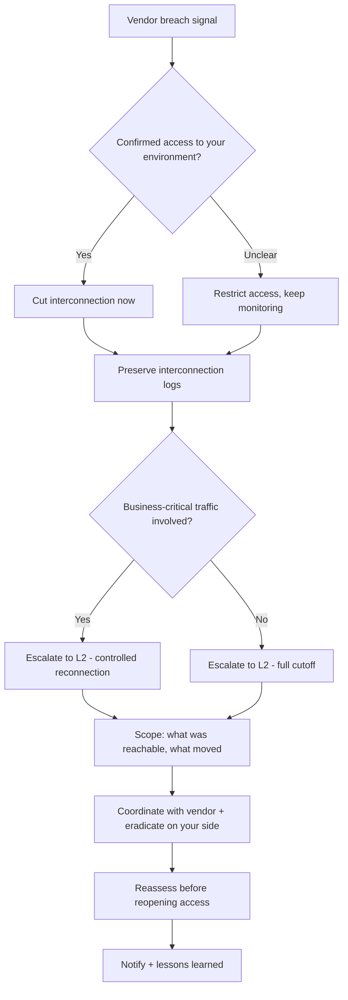

# Compromission tierce-partie / supply chain

**Statut :** 0.1 (brouillon)

---

## 1. Critères de déclenchement

Ouvrez ce runbook dès que l'un de ces signaux apparaît, seul ou combiné :

- Une veille de threat intelligence, un site de fuite, ou une source ouverte nomme l'un de vos fournisseurs, partenaires ou sous-traitants comme compromis.
- Le tiers lui-même vous notifie d'un incident de sécurité de son côté.
- Des motifs de trafic inhabituels apparaissent sur une interconnexion avec un partenaire ou un fournisseur — volume inattendu, nouvelles destinations, ou activité à heures inhabituelles.
- Une mise à jour logicielle, une bibliothèque, ou une dépendance d'un fournisseur se comporte de manière inattendue peu après son installation — appels réseau non autorisés, processus non reconnus, ou fichiers modifiés de manière inattendue.
- Un compte ou un identifiant appartenant à un tiers (accès support, compte d'intégration, clé API partagée) montre des signes de compromission ou un usage inhabituel.
- Un prestataire de services managés ou un fournisseur IT disposant d'un accès privilégié à votre environnement signale — ou est suspecté d'avoir subi — une compromission.

## 2. Objectifs de temps

- **L1 :** contenir l'interconnexion ou l'accès affecté en < 30 min après déclenchement.
- **L2 :** achever le cadrage et l'éradication en < 4 h après confinement.

Ce sont des cibles opérationnelles internes à challenger avec des données d'incidents réels — pas des délais réglementaires.

## 3. Arbre de décision

## 4. Actions L1

1. **Confirmez le signal.** Recoupez la mention sur le site de fuite, le rapport de threat intel, ou la notification du tiers lui-même, avec l'accès ou l'interconnexion réel que ce fournisseur a dans votre environnement.
   - **Outil dédié** : inventaire de fournisseurs/actifs ou entrée CMDB pour le tiers.
   - **Alternative CLI / open source** : un tableur ou fichier texte maintenu listant les comptes et interconnexions fournisseurs — filtrez-le à la recherche du nom du fournisseur.

2. **Coupez ou suspendez immédiatement l'interconnexion** si la compromission est confirmée, ou si l'accès critique pour l'activité ne dépend pas du maintien de la connexion. N'attendez pas le calendrier propre du fournisseur.
   - **Outil dédié** : déploiement de politique pare-feu / segmentation réseau (une action de coupure planifiée à l'avance).
   - **Alternative CLI / open source** : une règle pare-feu manuelle désactivant la route, le tunnel VPN, ou la plage IP spécifique liée au fournisseur (`iptables`, ACL pfSense/OPNsense), ou désactivez directement l'intégration/clé API spécifique.

3. **Désactivez tout compte, clé API, ou identifiant dédié à ce tiers** — accès support, compte d'intégration, ou compte de service.
   - **Outil dédié** : désactivation ciblée depuis la console IAM/PAM.
   - **Alternative CLI / open source** : `Disable-ADAccount -Identity <compte>`, ou révoquez la clé API/le jeton spécifique via la console d'administration du service concerné.

4. **Si l'email est le point d'interconnexion, mettez en quarantaine ou filtrez les messages du domaine du fournisseur affecté** plutôt que de le bloquer entièrement — vous aurez peut-être encore besoin de leurs mises à jour sur l'incident.
   - **Outil dédié** : règle de la passerelle de sécurité email (redirection vers une boîte aux lettres sandboxée, suppression des pièces jointes/liens).
   - **Alternative CLI / open source** : une règle côté serveur de messagerie retenant les messages du domaine pour une revue manuelle avant livraison.

5. **Préservez les logs de l'interconnexion** — trafic, authentification, appels API — avant qu'ils ne sortent de la rétention.
   - **Outil dédié** : export SIEM filtré sur les IP/comptes sources du fournisseur.
   - **Alternative CLI / open source** : exportez manuellement les logs pare-feu/VPN/passerelle API pertinents vers un fichier horodaté.

6. **Escaladez vers le L2 avec ce que vous avez** — quel fournisseur, quel accès il avait, et si du trafic critique pour l'activité dépend du maintien de la connexion.
   - **Outil dédié** : votre plateforme de gestion de cas/tickets.
   - **Alternative CLI / open source** : TheHive, ou un document d'incident partagé.

## 5. Actions L2

1. **Établissez un canal de communication direct avec l'équipe sécurité du fournisseur**, en dehors de votre email habituel si ce canal pourrait lui-même être affecté.
   - **Outil dédié** : le contact sécurité/incident dédié de votre fournisseur, depuis votre registre de risque fournisseurs.
   - **Alternative CLI / open source** : un appel téléphonique à un numéro déjà enregistré, ou un canal de messagerie hors bande.

2. **Déterminez le périmètre complet de ce que le fournisseur pouvait atteindre** : quels systèmes, données, ou identifiants étaient exposés via cette interconnexion.
   - **Outil dédié** : inventaire CMDB/actifs recoupé avec les logs d'accès.
   - **Alternative CLI / open source** : recoupez manuellement vos logs pare-feu/VPN/passerelle API avec votre propre inventaire d'actifs.

3. **Recherchez des indicateurs de mouvement latéral** depuis le point d'accès du fournisseur vers votre propre environnement.
   - **Outil dédié** : recherche d'IOC à l'échelle du parc via l'EDR/SIEM, en utilisant les indicateurs partagés par le fournisseur.
   - **Alternative CLI / open source** : règles YARA et revue Sysmon/Sysinternals sur les postes accessibles depuis le point d'accès du fournisseur.

4. **Si le fournisseur livre du logiciel, vérifiez si vous exécutez la version compromise**, et validez les mises à jour récentes contre des sommes de contrôle ou signatures connues comme saines avant de leur faire confiance.
   - **Outil dédié** : plateforme d'analyse de composition logicielle / gestion de SBOM.
   - **Alternative CLI / open source** : outils gratuits de SBOM et de dépendances comme Syft et Grype, ou `npm audit` / `pip-audit` selon l'écosystème concerné ; comparez les hashs de fichiers aux sommes de contrôle publiées par le fournisseur.

5. **Demandez un rapport d'incident formel et une liste d'indicateurs à jour au fournisseur**, et suivez la transparence de sa remédiation — traitez un fournisseur qui cesse de communiquer comme un risque toujours ouvert.
   - **Outil dédié** : suivi d'incident de la plateforme de gestion du risque fournisseurs.
   - **Alternative CLI / open source** : un document d'incident partagé consignant ce que le fournisseur a (et n'a pas) confirmé, mis à jour au fil des échanges.

6. **Coordonnez un confinement conjoint** lorsque la compromission se situe côté fournisseur — vous agissez de votre côté (désactiver, mettre en quarantaine) pendant qu'ils agissent du leur (révoquer l'accès de l'attaquant, faire tourner les secrets).
   - **Outil dédié** : un pont/appel d'incident conjoint entre les deux équipes sécurité.
   - **Alternative CLI / open source** : un journal d'incident partagé et horodaté, consultable et modifiable par les deux parties.

7. **Avant de rouvrir l'interconnexion, vérifiez avec des preuves — pas seulement l'assurance du fournisseur — que son environnement est sain**, et faites tourner chaque identifiant ou secret partagé avec lui.
   - **Outil dédié** : une évaluation de sécurité indépendante de la connexion restaurée avant remise en production.
   - **Alternative CLI / open source** : revérifiez manuellement la correction du fournisseur par rapport aux indicateurs d'origine, et faites tourner vous-même les clés API, mots de passe et certificats, quoi qu'il rapporte.

8. **Réévaluez le profil de risque de ce fournisseur et le périmètre de son accès pour l'avenir** — a-t-il besoin du même niveau d'accès qu'avant ?
   - **Outil dédié** : mise à jour du score de risque de la plateforme de gestion du risque fournisseurs.
   - **Alternative CLI / open source** : mettez à jour votre propre tableur de suivi fournisseurs avec l'incident et une recommandation de réduction d'accès.

## 6. Notifications & escalade

> Notifiez votre autorité compétente (CERT national, DPO, régulateur) selon la réglementation applicable à votre juridiction — consultez votre conseil juridique. Voir `finding-your-csirt.md` pour identifier qui contacter.

## 7. Erreurs à éviter

- **Faire confiance au « tout va bien » du fournisseur sans vérification indépendante** — sa propre lacune de détection est peut-être la raison pour laquelle il a été compromis.
- **Rouvrir l'interconnexion sans faire tourner chaque identifiant ou secret partagé** — un attaquant ayant eu accès côté fournisseur a pu les copier.
- **Bloquer entièrement toute communication avec le fournisseur, y compris l'email, alors que vous avez encore besoin de ses mises à jour** — filtrez ou mettez en quarantaine plutôt que de couper tous les canaux.
- **Considérer que c'est uniquement le problème du fournisseur** — s'il avait accès à votre environnement, vous devez cadrer votre propre côté indépendamment de la responsabilité.
- **Attendre un rapport formel avant toute action de confinement** — coupez ou restreignez l'accès sur simple suspicion, resserrez une fois confirmé.
- **Supposer qu'une mise à jour logicielle compromise n'affecte que le système où vous avez d'abord remarqué quelque chose d'anormal** — vérifiez chaque système exécutant le logiciel de ce fournisseur, pas seulement celui qui a déclenché l'alerte.

## 8. Ressources

- MITRE ATT&CK [T1195](https://attack.mitre.org/techniques/T1195/) — Supply Chain Compromise (T1195.001 Compromise Software Dependencies and Development Tools, T1195.002 Compromise Software Supply Chain, T1195.003 Compromise Hardware Supply Chain).
- MITRE ATT&CK [T1199](https://attack.mitre.org/techniques/T1199/) — Trusted Relationship.
- Outils cités en exemple : Syft, Grype, OWASP Dependency-Check, `npm audit`, `pip-audit`, TheHive, MISP.

## 9. Sources d'inspiration

- CERT Société Générale — IRM #19 « Third-Party Compromise » (v1.0) — `github.com/certsocietegenerale/IRM` — CC BY 3.0 Unported.
- CERT aDvens — IRM-19 « Compromission d'un tiers » (2025-10-27) — `github.com/cert-advens/IRM` — CC BY 3.0 Unported.
