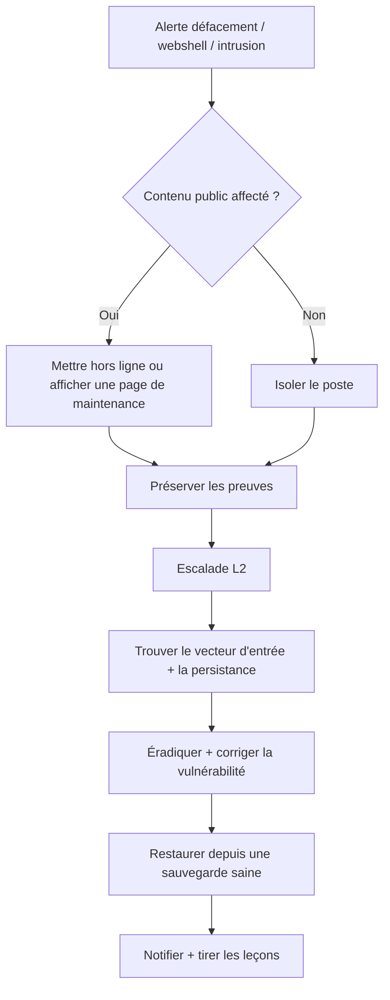

# Compromission d'application/serveur web

**Statut :** 0.1 (brouillon)

---

## 1. Critères de déclenchement

Ouvrez ce runbook dès que l'un de ces signaux apparaît, seul ou combiné :

- Le contenu d'une page publique a été altéré sans autorisation — un message de défacement évident, ou une injection discrète (ex. un `iframe` ou script caché).
- Un fichier inattendu apparaît dans un répertoire accessible depuis le web (script inconnu, fichier au nom inhabituel, fichier aux permissions suspectes).
- Un serveur montre des connexions sortantes non reconnues, des processus inconnus, ou une activité CPU/réseau qui ne correspond pas à son comportement habituel.
- Une règle WAF, IDS/IPS, ou d'analyse de logs se déclenche sur un motif d'exploitation (injection SQL, inclusion de fichier distant, signature d'un CVE connu) contre une application exposée.
- Un compte local ou administrateur non reconnu apparaît sur un serveur, ou une tâche planifiée/cron job que personne n'a créé.
- Une alerte de surveillance d'intégrité de fichiers se déclenche pour des modifications inattendues de binaires système ou de contenu web.
- Un utilisateur, un service public de suivi de vulnérabilités (ex. Google Safe Browsing), ou un chercheur en sécurité signale que votre site est compromis ou sert du contenu malveillant.

## 2. Objectifs de temps

- **L1 :** contenir l'hôte/service affecté en < 30 min après déclenchement.
- **L2 :** achever l'éradication en < 4 h après confinement.

Ce sont des cibles opérationnelles internes à challenger avec des données d'incidents réels — pas des délais réglementaires.

## 3. Arbre de décision

## 4. Actions L1

1. **Confirmez la compromission.** Vérifiez la présence d'un contenu défacé, d'un fichier inattendu dans la racine web, de processus ou connexions non reconnus, ou l'alerte à l'origine du déclenchement (règle WAF/IDS, contrôle d'intégrité de fichiers).
   - **Outil dédié** : console d'alertes EDR/WAF, ou service de surveillance d'intégrité de site web.
   - **Alternative CLI / open source** : comparez manuellement la page/les fichiers actuels à une référence saine connue ; listez les fichiers récemment modifiés avec `find /var/www -mtime -1 -type f` (Linux) ou `Get-ChildItem -Recurse | Sort-Object LastWriteTime -Descending` (Windows).

2. **Confinez l'hôte.** Pour un service critique, isolez-le du réseau en le laissant allumé (préserve les preuves) ; pour un hôte non critique, vous pouvez l'éteindre directement — ce scénario ne présente pas le risque d'extinction destructrice propre au ransomware.
   - **Outil dédié** : isolation réseau de l'EDR, ou règle de pare-feu/répartiteur de charge retirant l'hôte de la rotation.
   - **Alternative CLI / open source** : désactivez la carte réseau (`ip link set <iface> down` / `netsh interface set interface "<nom>" admin=disable`), ou déconnectez physiquement l'hôte.

3. **Si le contenu public est affecté, mettez-le hors ligne ou redirigez vers une page de maintenance statique** — HTML statique uniquement, aucun code dynamique, afin que la même vulnérabilité ne puisse pas être ré-exploitée pendant l'investigation.
   - **Outil dédié** : règle de basculement CDN/WAF, ou mode maintenance.
   - **Alternative CLI / open source** : pointez la racine documentaire du serveur web, ou votre cible DNS/répartiteur de charge, vers une page statique HTML préparée à l'avance.

4. **Préservez les preuves avant toute remédiation.** Capturez une image disque et/ou mémoire si possible sans délai, et prenez une copie horodatée de tout contenu défacé.
   - **Outil dédié** : capture forensique / imagerie disque complète de l'EDR.
   - **Alternative CLI / open source** : `dd` ou FTK Imager pour une image disque, un outil gratuit de capture mémoire compatible Volatility, et `wget`/HTTrack pour une copie horodatée d'une page défacée.

5. **Désactivez les comptes et identifiants potentiellement compromis** — en particulier tout compte local ou administrateur du serveur que vous ne reconnaissez pas.
   - **Outil dédié** : console IAM/PAM.
   - **Alternative CLI / open source** : `usermod -L <compte>` (Linux) ou `net user <compte> /active:no` (Windows) ; vérifiez `/etc/passwd` à la recherche d'entrées UID 0 inattendues.

6. **Escaladez vers le L2 avec ce que vous avez** — hôte/service affecté, un échantillon du défacement ou du fichier suspect, une chronologie approximative, et si la vulnérabilité semble encore exploitable.
   - **Outil dédié** : votre plateforme de gestion de cas/tickets.
   - **Alternative CLI / open source** : TheHive, ou un document d'incident partagé.

## 5. Actions L2

1. **Identifiez le vecteur d'entrée.** Vérifiez les logs serveur et d'erreurs à la recherche d'une injection SQL, d'une inclusion de fichier distant, d'un plugin CMS vulnérable, d'un panneau d'administration exposé, ou de l'exploitation d'un CVE connu non corrigé.
   - **Outil dédié** : recherche forensique de logs du WAF/IDS.
   - **Alternative CLI / open source** : filtrez manuellement les logs d'accès/erreurs (ex. `grep -i "union select\|\.\./\.\." access.log`) et examinez les requêtes autour du moment de la compromission.

2. **Recherchez des webshells et fichiers non autorisés.** Cherchez les fichiers récemment modifiés ou créés dans les répertoires accessibles depuis le web, et les fichiers aux noms, permissions, ou motifs de contenu inhabituels.
   - **Outil dédié** : module de détection de webshells de l'EDR ou dédié.
   - **Alternative CLI / open source** : exécutez des règles YARA contre des signatures de webshells connues ; `find /var/www -mtime -7 -type f` combiné à une revue manuelle de tout fichier correspondant à des motifs de webshell courants (usage intensif de `base64`/`eval()` dans un script, par exemple).

3. **Identifiez la persistance au-delà de la racine web** — tâches planifiées, cron jobs, nouveaux services, entrées de démarrage automatique, ou clés SSH/comptes ajoutés par l'attaquant.
   - **Outil dédié** : module de recherche de persistance de l'EDR.
   - **Alternative CLI / open source** : Sysinternals Autoruns (Windows) ; examinez manuellement `crontab -l`, `/etc/cron.*`, et `~/.ssh/authorized_keys` (Linux).

4. **Vérifiez les mouvements latéraux** — si l'hôte compromis s'est connecté à d'autres systèmes ou partages internes qu'il ne devrait pas atteindre.
   - **Outil dédié** : analyse de flux réseau de l'EDR à l'échelle du parc.
   - **Alternative CLI / open source** : examinez manuellement les logs pare-feu ou NetFlow, et corrélez l'historique de connexions sortantes de l'hôte avec votre inventaire d'actifs.

5. **Corrigez la cause racine avant de rétablir le service** — patchez la vulnérabilité exploitée, mettez à jour ou supprimez le plugin CMS vulnérable, fermez le dossier ouvert/inscriptible, ou corrigez le code injectable.
   - **Outil dédié** : plateforme de gestion des vulnérabilités suivant le correctif jusqu'à sa clôture.
   - **Alternative CLI / open source** : appliquez vous-même le correctif éditeur, ou ajoutez une règle WAF/reverse-proxy bloquant le motif d'exploitation spécifique si un correctif définitif n'est pas encore prêt.

6. **Reconstruisez plutôt que de nettoyer en cas de doute.** Réinstallez le serveur à partir d'une image connue saine ou d'une source de paquets officielle plutôt que de tenter de supprimer manuellement chaque artefact de l'attaquant.
   - **Outil dédié** : votre pipeline standard d'imagerie serveur / image de référence.
   - **Alternative CLI / open source** : réinstallez depuis l'ISO/les paquets officiels de la distribution et réappliquez la configuration depuis le gestionnaire de versions.

7. **Restaurez le contenu depuis une sauvegarde vérifiée saine, et réinitialisez les identifiants** de chaque compte ayant accès au serveur — panneau d'administration, déploiement, et base de données.
   - **Outil dédié** : restauration avec vérification d'intégrité de la plateforme de sauvegarde.
   - **Alternative CLI / open source** : restaurez depuis une sauvegarde antérieure à la compromission, vérifiée par hashs connus ; réinitialisez manuellement le mot de passe de chaque compte affecté.

8. **Surveillez étroitement après le rétablissement du service.** La même vulnérabilité, ou une porte dérobée oubliée, est la cause la plus fréquente de réinfection.
   - **Outil dédié** : alertes WAF/IDS ajustées sur les indicateurs confirmés, plus surveillance d'intégrité/de disponibilité.
   - **Alternative CLI / open source** : un script planifié comparant les hashs de fichiers actuels à la référence saine, et une revue manuelle des logs pendant plusieurs jours après la reprise.

## 6. Notifications & escalade

> Notifiez votre autorité compétente (CERT national, DPO, régulateur) selon la réglementation applicable à votre juridiction — consultez votre conseil juridique. Voir `finding-your-csirt.md` pour identifier qui contacter.

## 7. Erreurs à éviter

- **Éteindre un hôte critique avant d'avoir capturé les preuves volatiles** — détruit les indicateurs résidant en mémoire. (Pour un hôte réellement non critique, l'extinction est un compromis acceptable — sachez simplement dans quel cas vous êtes.)
- **Restaurer le contenu ou le service avant d'avoir corrigé la vulnérabilité racine** — le même webshell ou exploit réapparaît en quelques heures.
- **Ne supprimer que le défacement ou le webshell visible** sans rechercher une persistance additionnelle (cron jobs, nouveaux comptes, clés SSH) — l'attaquant regagne silencieusement l'accès.
- **Supposer que la compromission se limite à l'application web** — vérifiez si l'hôte sous-jacent ou d'autres services ont aussi été touchés.
- **Faire confiance aux fichiers de logs et hashs locaux sans vérifier qu'ils n'ont pas été altérés** — un attaquant avec un accès root/administrateur peut altérer les logs locaux.
- **Considérer un défacement « anodin » comme peu prioritaire** — même un message pour rire signifie que l'attaquant avait un accès en écriture, et la reconnaissance ou un point d'ancrage persistant peut être le véritable objectif, pas le message visible.

## 8. Ressources

- MITRE ATT&CK [T1190](https://attack.mitre.org/techniques/T1190/) — Exploit Public-Facing Application.
- MITRE ATT&CK [T1505.003](https://attack.mitre.org/techniques/T1505/003/) — Server Software Component: Web Shell.
- MITRE ATT&CK [T1053](https://attack.mitre.org/techniques/T1053/) — Scheduled Task/Job.
- MITRE ATT&CK [T1136](https://attack.mitre.org/techniques/T1136/) — Create Account.
- Outils cités en exemple : YARA, Sysinternals Autoruns, AIDE, rkhunter, Sleuth Kit/Autopsy, Volatility, FTK Imager, HTTrack, TheHive.

## 9. Sources d'inspiration

- CERT Société Générale — IRM #2 « Windows Intrusion Detection » (v2.0) — `github.com/certsocietegenerale/IRM` — CC BY 3.0 Unported.
- CERT Société Générale — IRM #3 « Unix/Linux Intrusion Detection » (v2.0) — `github.com/certsocietegenerale/IRM` — CC BY 3.0 Unported.
- CERT Société Générale — IRM #6 « Website Defacement » (v2.0) — `github.com/certsocietegenerale/IRM` — CC BY 3.0 Unported.
- Counteractive — « Playbook: Website Defacement » — `github.com/counteractive/incident-response-plan-template` — Apache License 2.0.
