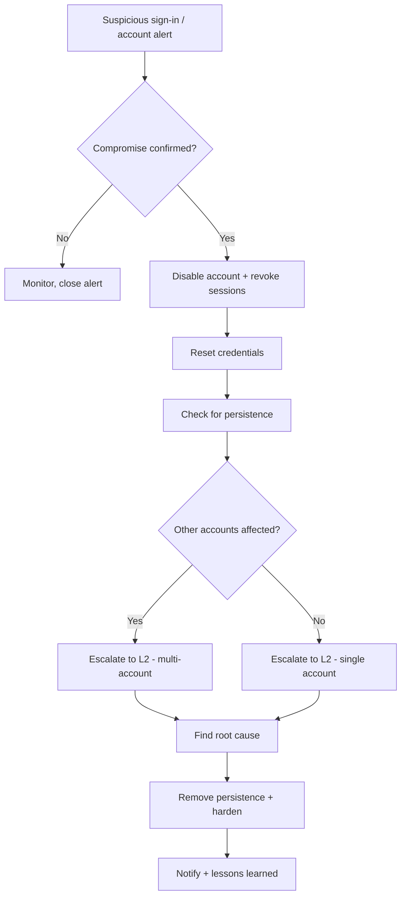

# Account Compromise

**Status:** 0.1 (draft)

---

## 1. Trigger Criteria

Open this runbook when any of the following appear, alone or together:

- A sign-in alert or risk score fires for anomalous activity: new country, new device, impossible travel, or a login from a known-malicious IP.
- A user reports an MFA prompt they did not request, or a password-reset notification they did not initiate.
- A SIEM, firewall, or identity provider alert shows a large number of failed sign-ins across one or many accounts in a short window (a password-spray pattern).
- A user reports receiving a suspicious email shortly before noticing unusual account behavior.
- Unexpected mailbox forwarding rules, transport rules, or delegated mailbox access appear that no admin configured.
- An alert fires for a "risky application" or an unexpected OAuth consent grant appears in the audit log.
- Data appears to be leaving an account's mailbox or file storage at an unusual volume or time.

## 2. Time Objectives

- **L1:** contain the affected account(s) within < 30 min of trigger.
- **L2:** complete eradication within < 4 h of containment.

These are internal operational targets to challenge with real incident data — not regulatory deadlines.

## 3. Decision Tree

## 4. L1 Actions

1. **Confirm the compromise.** Cross-check the alert against sign-in/audit logs for anomalies: new country, new device or browser, impossible travel between two sign-ins, or MFA failures followed by a success.
   - **Dedicated tool**: your identity provider's risk detection / sign-in log (e.g. Microsoft Entra ID Protection, Okta System Log).
   - **CLI / open-source alternative**: export and grep the sign-in log through your IdP's free API/CLI tooling (e.g. `Get-MgAuditLogSignIn` via the free Microsoft Graph PowerShell module); for self-hosted systems, grep `auth.log`/`journalctl` for repeated or geographically inconsistent logons.

2. **Disable the account and revoke all active sessions and tokens immediately.** A password reset alone does not end a session the attacker already opened.
   - **Dedicated tool**: identity provider admin console "revoke sessions" / "block sign-in" action.
   - **CLI / open-source alternative**: `Revoke-MgUserSignInSession` (free Microsoft Graph PowerShell module) or your IdP's session-revocation API; for local/LDAP accounts, disable the account and kill active sessions/tickets at the directory server.

3. **Reset the account's credentials, and remove any authentication factor (MFA method) you don't recognize.**
   - **Dedicated tool**: identity provider console credential reset.
   - **CLI / open-source alternative**: directory service password-reset command (e.g. `Set-ADAccountPassword` for on-prem AD); manually remove unrecognized MFA methods from the user's registration in the same console.

4. **Check for attacker persistence set up through the account**: mailbox forwarding or inbox rules, mail-flow/transport rules, delegated mailbox access, or newly consented third-party (OAuth) applications.
   - **Dedicated tool**: mailbox admin console rule inspector / app-consent inventory.
   - **CLI / open-source alternative**: export inbox/transport rules through your mail platform's free admin CLI, or inspect them manually via the webmail settings UI; for OAuth apps, a short script against your IdP's free API listing the user's granted consents.

5. **Preserve evidence.** Keep the original phishing email if one exists, the exact sign-in log entries, the list of consented apps and their permissions, and precise timestamps.
   - **Dedicated tool**: SIEM case export / identity provider audit log export.
   - **CLI / open-source alternative**: manually export the relevant log lines to a timestamped text file; save the phishing email with full headers intact.

6. **Escalate to L2 with what you have** — account(s) affected, suspected entry point (phishing, password spray, consent grant), and whether other accounts show the same pattern.
   - **Dedicated tool**: your case-management/ticketing platform.
   - **CLI / open-source alternative**: TheHive, or a shared incident document — whatever your team already uses to hand off cases.

## 5. L2 Actions

1. **Determine the entry point.** Was it a phishing email (check headers, sender, links/attachments), a password-spray/brute-force pattern (many failed logons across many accounts from a small set of IPs), a reused/leaked credential, or a consent-grant phishing attack?
   - **Dedicated tool**: email security gateway forensic search, combined with your identity provider's risk-detection detail.
   - **CLI / open-source alternative**: manually review mail headers (SPF/DKIM/DMARC results) and correlate failed-logon timestamps and source IPs across accounts in your exported logs.

2. **Inventory every third-party (OAuth) application** with access to the account or the organization, and the permissions each one was granted.
   - **Dedicated tool**: cloud app security / CASB console.
   - **CLI / open-source alternative**: a script against your identity provider's free API (community scripts such as `Get-AzureADPSPermissions` exist for this) or manual review through the app-consent admin page.

3. **Disable — do not delete — any application found with illegitimate or excessive permissions.** Deleting it can let it silently return if any user later re-consents; disabling blocks it permanently while you finish scoping.
   - **Dedicated tool**: identity provider's "disable application" action.
   - **CLI / open-source alternative**: an API call disabling the application's service principal / OAuth client registration.

4. **Determine the full scope.** Which other accounts received the same phishing email, share the same password-spray source IPs, or granted consent to the same malicious application?
   - **Dedicated tool**: SIEM correlation search across the organization.
   - **CLI / open-source alternative**: grep or script across your exported logs for the same sender address, source IPs, or application ID.

5. **Block the attacker's source IP(s) and any confirmed-malicious sending domains**, while treating this as a temporary measure — attackers behind VPN or cloud infrastructure rotate IPs quickly.
   - **Dedicated tool**: firewall / conditional-access policy push.
   - **CLI / open-source alternative**: a manual firewall ACL entry or mail-gateway blocklist entry.

6. **Remove all persistence found in L1, across every affected account**: delete malicious inbox/transport rules, revoke malicious app consents organization-wide, and remove unrecognized MFA methods and delegated access.
   - **Dedicated tool**: bulk remediation via the admin console or an automation runbook.
   - **CLI / open-source alternative**: a short script looping the same manual removal steps across the list of affected accounts.

7. **Harden to prevent a repeat.** Enforce MFA for all accounts if it isn't already universal, disable legacy/basic authentication protocols that bypass MFA, and turn on risk-based sign-in policies if your identity provider supports them.
   - **Dedicated tool**: identity provider's conditional-access / risk-policy configuration.
   - **CLI / open-source alternative**: for self-hosted identity providers, enforce MFA at the application or reverse-proxy layer with a free auth gateway (e.g. Authelia, Keycloak), and disable legacy protocol endpoints in configuration.

8. **Watch for a second wave.** An attacker who successfully reused a phished credential or consent grant once often targets other users in the same organization shortly after.
   - **Dedicated tool**: a SIEM alert rule tuned to the confirmed indicators (sender, source IP, application ID).
   - **CLI / open-source alternative**: a scheduled log-grep job watching for the same indicators going forward.

## 6. Notification & Escalation

> Notify your competent authority (national CERT, DPO, regulator) according to the regulations applicable in your jurisdiction — consult your legal counsel. See `finding-your-csirt.md` to identify who to contact.

## 7. Pitfalls to Avoid

- **Resetting the password without revoking active sessions and tokens** — the attacker's existing session survives a password change.
- **Deleting a malicious application instead of disabling it** — it can silently regain access if any user re-consents to it later.
- **Treating a single compromised account as the full scope** — password spray and consent-phishing are campaign techniques that usually target many accounts at once.
- **Restoring the account to normal use before removing forwarding rules, delegated access, and unrecognized MFA methods** — these survive a password reset and let the attacker back in silently.
- **Treating an IP block as durable containment** — attackers behind VPN or cloud infrastructure rotate source IPs quickly.
- **Assuming MFA alone stops an attacker who already holds a live session token or an OAuth consent grant** — neither requires re-authenticating.

## 8. Resources

- MITRE ATT&CK [T1078](https://attack.mitre.org/techniques/T1078/) — Valid Accounts.
- MITRE ATT&CK [T1110](https://attack.mitre.org/techniques/T1110/) — Brute Force (password spray is sub-technique T1110.003).
- MITRE ATT&CK [T1098.001](https://attack.mitre.org/techniques/T1098/001/) — Account Manipulation: Additional Cloud Credentials.
- MITRE ATT&CK [T1114.003](https://attack.mitre.org/techniques/T1114/003/) — Email Collection: Email Forwarding Rule.
- Tools cited as examples: the free Microsoft Graph PowerShell module, TheHive, MISP, open-source auth gateways such as Authelia or Keycloak, fail2ban.

## 9. Sources of Inspiration

- Microsoft — "Phishing investigation" (Incident response playbooks) — `github.com/MicrosoftDocs/security` — CC BY 4.0 (documentation content).
- Microsoft — "Password spray investigation" (Incident response playbooks) — `github.com/MicrosoftDocs/security` — CC BY 4.0.
- Microsoft — "App consent grant investigation" (Incident response playbooks) — `github.com/MicrosoftDocs/security` — CC BY 4.0.
- Microsoft — "Compromised and malicious applications investigation" (Incident response playbooks) — `github.com/MicrosoftDocs/security` — CC BY 4.0.
