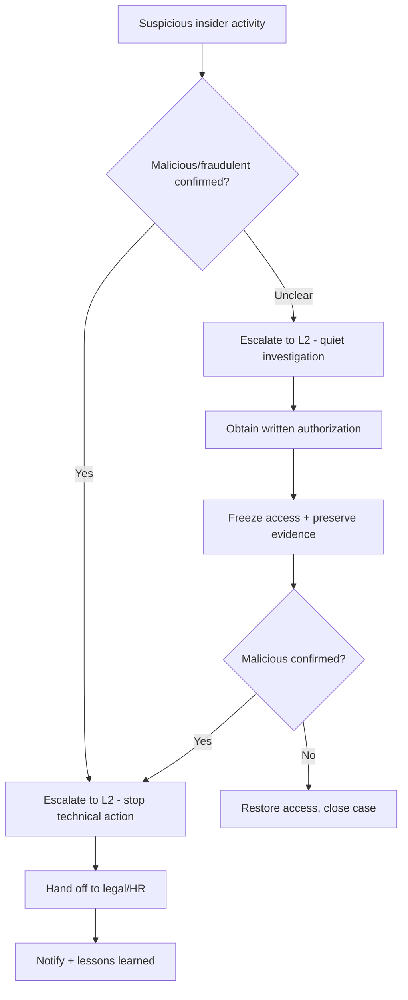

# Insider Threat

**Status:** 0.1 (draft)

---

## 1. Trigger Criteria

Open this runbook when any of the following appear, alone or together:

- A SIEM or correlation rule flags anomalous behavior tied to a specific, already-authenticated internal account.
- A DLP alert fires for unusual data exfiltration or mass download by an authorized user.
- A physical access control system logs badge use outside a person's normal hours or location.
- A manager or colleague reports suspicious behavior from a team member.
- The risk, compliance, or audit team flags an operational anomaly traceable to a specific employee.
- An external partner reports discrepancies that point back to an internal actor.
- An employee's access pattern changes sharply around a resignation or termination date.

## 2. Time Objectives

- **L1:** confirm and escalate within < 30 min of a credible detection — L1 does **not** contain unilaterally in this runbook (see Pitfalls).
- **L2:** complete authorized containment within < 4 h of receiving sign-off.

These are internal operational targets to challenge with real incident data — not regulatory deadlines. Unlike most runbooks in this project, speed is secondary to authorization here: acting before the right people sign off is the primary risk, not delay.

## 3. Decision Tree

## 4. L1 Actions

1. **Confirm the report is credible.** Cross-check the alert against logs for the specific account involved — not the whole environment.
   - **Dedicated tool**: SIEM/UEBA console, pivoted to the user.
   - **CLI / open-source alternative**: manually review the account's authentication and file-access logs — Windows Security Event Log, or `auditd` logs on Linux — for the relevant time window.

2. **Do not take any containment or confrontational action yourself.** Escalate immediately to L2 and your incident lead with what you have.
   - **Dedicated tool**: your case-management/ticketing platform, flagged as a restricted-visibility case.
   - **CLI / open-source alternative**: TheHive with case visibility limited to named responders, or a private, access-limited channel — avoid your team's normal shared channel.

3. **Preserve the triggering evidence exactly as found** — screenshot, log excerpt, export — without alerting the subject or their colleagues that an investigation has started.
   - **Dedicated tool**: SIEM case export / EDR forensic snapshot.
   - **CLI / open-source alternative**: manually export the relevant log lines to a timestamped file; record exact system times and your own actions for a clean audit trail.

4. **Note whether the person still has active access right now** — currently employed, on notice, or already departed. This changes how urgently L2 needs to move.
   - **Dedicated tool**: HR/IAM system employee-status lookup.
   - **CLI / open-source alternative**: check the account's last successful authentication and current group memberships directly in your directory service.

5. **Confirm the authorization path before anything further happens.** Nothing beyond detection and escalation should proceed without written sign-off from the appropriate stakeholders (see L2 Action 1).
   - **Dedicated tool**: your incident-management platform's approval workflow.
   - **CLI / open-source alternative**: a simple written approval (email, or a signed ticket comment) kept as part of the case record.

## 5. L2 Actions

1. **Involve the right people before proceeding.** Typically HR, legal counsel, and the subject's manager, alongside your investigation lead. Nothing past this point happens without their sign-off.
   - **Dedicated tool**: your incident-management platform's stakeholder/approval workflow.
   - **CLI / open-source alternative**: a written record (email thread, signed ticket) naming who authorized what, kept with the case file.

2. **Once authorized, freeze the subject's access all at once** — application entitlements, system/service accounts, remote access (VPN, tokens), and physical access (badge) — to avoid tipping them off between steps.
   - **Dedicated tool**: IAM/PAM console bulk revoke, combined with the physical access control system.
   - **CLI / open-source alternative**: `Disable-ADAccount` or your directory service's equivalent for the account; manual badge deactivation via the building system; manual removal of VPN/remote-access profiles.

3. **If the subject remains at work pending the outcome, reduce access to the minimum needed** rather than removing it outright — this avoids alerting them prematurely while you finish scoping.
   - **Dedicated tool**: least-privilege / just-in-time access platform.
   - **CLI / open-source alternative**: manually adjust group memberships to a restricted baseline in your directory service.

4. **Investigate without tipping off the subject**: authentication logs, file/data access history, and — with proper authorization — the content of their work devices and accounts.
   - **Dedicated tool**: forensic imaging platform, DLP investigation console.
   - **CLI / open-source alternative**: standard host forensics tooling (e.g., a free disk imager, native OS log review) — see `runbooks/account-compromise.md` for the general log-investigation technique; this runbook covers what's specific to the insider angle.

5. **Review any code, scripts, scheduled tasks, or automation the subject created or had access to**, for anything that could serve as a backdoor or sabotage mechanism.
   - **Dedicated tool**: source-control audit tooling, EDR persistence-hunting.
   - **CLI / open-source alternative**: manually review commit history and scheduled tasks/cron jobs on systems the subject administered; Sysinternals Autoruns for Windows persistence review.

6. **Determine the full scope**: what data or systems were accessed, over what time period, and what left the organization's control.
   - **Dedicated tool**: DLP/CASB activity log, data classification platform.
   - **CLI / open-source alternative**: manually correlate file-access timestamps against outbound transfer logs (email, cloud upload, removable media) from whatever logging you have.

7. **If malicious or fraudulent activity is confirmed, stop independent technical investigation and hand off to legal counsel** — and law enforcement, at their direction — with the evidence you've gathered. Don't keep digging on your own past this point.
   - **Dedicated tool**: your case-management platform's evidence-export / chain-of-custody feature.
   - **CLI / open-source alternative**: a documented, timestamped evidence package (with hashes of exported files/logs), handed over per your legal team's instructions.

8. **If nothing malicious is ultimately confirmed, restore the person's access and close the case discreetly.** A cleared employee shouldn't carry a visible mark from the investigation.
   - **Dedicated tool**: IAM console access restoration.
   - **CLI / open-source alternative**: reverse the same manual steps used to freeze access.

## 6. Notification & Escalation

> Notify your competent authority (national CERT, DPO, regulator) according to the regulations applicable in your jurisdiction — consult your legal counsel. See `finding-your-csirt.md` to identify who to contact.

## 7. Pitfalls to Avoid

- **Taking containment action — disabling access, confronting the person — before getting written authorization.** This is the single most important rule in this runbook; skipping it can create legal exposure for the organization.
- **Discussing the investigation in normal team channels** or with colleagues not read into the case — insider cases need tighter information control than most other incidents.
- **Continuing your own technical investigation after malicious or fraudulent activity is confirmed.** From that point, evidence handling follows your legal team's direction, not standard IR practice.
- **Freezing only some access paths** (e.g., the main account) while leaving others open (VPN, physical badge, service accounts) — partial containment tips off a capable insider without actually stopping them.
- **Treating a cleared case as evidence-free.** Document it anyway — an incomplete audit trail is itself a liability, even when nothing malicious is found.
- **Assuming remediation is purely a technical problem.** Disciplinary and legal decisions are outside a technical responder's role; your job is evidence, not judgment.

## 8. Resources

- MITRE ATT&CK [T1078](https://attack.mitre.org/techniques/T1078/) — Valid Accounts (relevant when a departed employee's access hasn't been revoked).
- MITRE ATT&CK [T1531](https://attack.mitre.org/techniques/T1531/) — Account Access Removal (a common sabotage pattern: locking others out on the way out).
- MITRE ATT&CK [T1052](https://attack.mitre.org/techniques/T1052/) — Exfiltration Over Physical Medium (the classic removable-media exfiltration path).
- Tools cited as examples: `auditd`, the Sysinternals Suite (Autoruns, Sysmon), TheHive, MISP, osquery, free disk-imaging tools.

## 9. Sources of Inspiration

- CERT Société Générale — IRM #12 "Insider Abuse" (v2.0) — `github.com/certsocietegenerale/IRM` — CC BY 3.0 Unported.
- CERT aDvens — IRM-12 "Attaques en interne" (2025-10-27) — `github.com/cert-advens/IRM` — CC BY 3.0 Unported.
