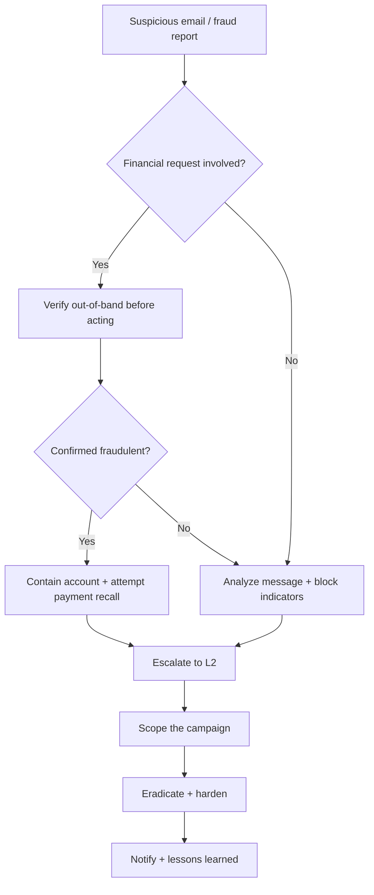

# Phishing / Business Email Compromise (BEC)

**Status:** 0.1 (draft)

---

## 1. Trigger Criteria

Open this runbook when any of the following appear, alone or together:

- A user reports a suspicious email, or an email security tool flags one (spam trap, threat-intel feed, phishing-repository match).
- An email requests a wire transfer, a change to payment/banking details, or sensitive information — especially with an urgent or secretive tone.
- An email's tone, language, or formatting deviates from how a known contact or executive normally writes.
- Multiple users receive near-identical suspicious messages in a short window.
- A new mailbox rule appears that auto-forwards or auto-deletes messages, and no one configured it.
- A finance or accounts-payable team member flags an unusual vendor payment change request.
- Web logs show unexpected traffic to a lookalike domain, or a monitored phishing repository lists your organization as a target.

## 2. Time Objectives

- **L1:** contain the affected account(s)/message(s) within < 30 min of trigger.
- **L2:** complete eradication within < 4 h of containment.

These are internal operational targets to challenge with real incident data — not regulatory deadlines. Note: if a fraudulent wire transfer is involved, the window to request a bank recall is measured in hours, not days — treat that specific step as more time-critical than the general objectives above.

## 3. Decision Tree

## 4. L1 Actions

1. **Confirm the report.** Get the suspicious message itself — headers, body, attachments, links — without opening attachments or following links on any device with access to sensitive data or credentials.
   - **Dedicated tool**: email security gateway's message trace / quarantine view.
   - **CLI / open-source alternative**: export the raw message (`.eml`) via "view source" / "download message" in the mail client, and inspect it offline on an isolated machine.

2. **If a financial request is involved (wire transfer, payment-detail change, gift cards), verify it out-of-band before acting on it** — call the requester on a number you already had on file, never one supplied in the message.
   - **Dedicated tool**: a pre-established vendor/executive contact directory in your finance system.
   - **CLI / open-source alternative**: a shared, offline contact list (spreadsheet or printed sheet) maintained outside of email.

3. **If a transfer already went out, contact your bank or payment provider immediately to request a recall or hold.** Speed matters more here than almost anywhere else in this project — recall windows close within hours.
   - **Dedicated tool**: your bank's fraud/dispute hotline or online fraud-report portal.
   - **CLI / open-source alternative**: there's no CLI substitute for calling your bank — do it immediately, and follow up in writing for the record.

4. **Identify who else received the same message**, and whether anyone clicked a link, opened an attachment, or entered credentials.
   - **Dedicated tool**: email security gateway's "who received this" search, or SIEM correlation.
   - **CLI / open-source alternative**: search your mail server logs for the same sender, subject, or message-ID across mailboxes.

5. **Contain any account that entered credentials or shows signs of compromise**: disable it, revoke active sessions, and reset its password — see `runbooks/account-compromise.md` for the full procedure.
   - **Dedicated tool**: identity provider admin console.
   - **CLI / open-source alternative**: the same free commands as in the Account Compromise runbook (e.g. `Disable-ADAccount`, `Revoke-MgUserSignInSession`).

6. **Block the sender and any malicious domains, links, or attachments found**, and remove the message from other inboxes where possible.
   - **Dedicated tool**: email security gateway policy push.
   - **CLI / open-source alternative**: a mail-server-side rule blocking the sender/subject, or a script removing the message via your mail platform's free admin CLI.

7. **Escalate to L2 with what you have** — the message itself, who was targeted, and whether any credentials or money moved.
   - **Dedicated tool**: your case-management/ticketing platform.
   - **CLI / open-source alternative**: TheHive, or a shared incident document.

## 5. L2 Actions

1. **Analyze the message and any attachments/links in an isolated or sandboxed environment.** Check headers (SPF/DKIM/DMARC results, originating server) and submit links/attachments/hashes to a scanning service.
   - **Dedicated tool**: enterprise sandbox / threat-intelligence platform.
   - **CLI / open-source alternative**: submit hashes and URLs to VirusTotal, or detonate attachments in a free sandbox such as Cuckoo or a disposable VM.

2. **Determine the campaign type** — credential harvesting, malware delivery, or a BEC fraud attempt — and whether it's targeted or opportunistic.
   - **Dedicated tool**: threat-intelligence platform correlation against known campaigns.
   - **CLI / open-source alternative**: manually check the message against a public phishing repository such as PhishTank or Google Safe Browsing.

3. **Audit mailbox rules and delegated access** on every account that received the message or shows signs of compromise, looking for auto-forwarding or auto-deleting rules the attacker may have planted.
   - **Dedicated tool**: mailbox admin console rule inspector.
   - **CLI / open-source alternative**: export inbox/transport rules through your mail platform's free admin CLI, as in `runbooks/account-compromise.md`.

4. **Determine the full scope**: total number of targeted and affected users, departments involved, and total financial exposure if a fraud attempt succeeded.
   - **Dedicated tool**: SIEM correlation search across the organization.
   - **CLI / open-source alternative**: grep or script across exported mail and authentication logs for the same sender, links, or message-ID.

5. **If fraudulent content is hosted online** (a lookalike login page, a spoofed invoice portal), identify its hosting provider and registrar, and file an abuse/takedown request with evidence attached (headers, screenshots, timestamps).
   - **Dedicated tool**: a brand-protection / takedown service.
   - **CLI / open-source alternative**: run `whois` on the domain yourself, take a timestamped copy of the page with a free tool such as HTTrack, and email the hosting provider's abuse contact directly.

6. **Harden email authentication and mailbox defenses.** Confirm SPF, DKIM, and DMARC are correctly configured, disable legacy authentication protocols that bypass MFA, and tighten filters based on the indicators you found.
   - **Dedicated tool**: email security gateway policy configuration.
   - **CLI / open-source alternative**: publish or adjust your SPF/DMARC DNS records directly (free, standard DNS) and confirm they resolve correctly with `dig txt` plus a free online DMARC checker.

7. **If money moved, work with finance to document the loss** and add temporary friction to the payment process — out-of-band verification, a second approver — until you've confirmed the underlying control gap is fixed.
   - **Dedicated tool**: finance/ERP system workflow configuration.
   - **CLI / open-source alternative**: a manually enforced checklist requiring a phone callback before any payment-detail change, until the automated control is back in place.

8. **Watch for a second wave or a repeat attempt against the same target.** Successful BEC attempts are frequently followed by a second, more urgent request within days.
   - **Dedicated tool**: a SIEM alert rule tuned to the confirmed indicators (sender, domain, message pattern).
   - **CLI / open-source alternative**: a scheduled log-grep job watching for the same indicators going forward.

## 6. Notification & Escalation

> Notify your competent authority (national CERT, DPO, regulator) according to the regulations applicable in your jurisdiction — consult your legal counsel. See `finding-your-csirt.md` to identify who to contact.

## 7. Pitfalls to Avoid

- **Calling the phone number or replying to the email address given in the suspicious message to "verify" it** — that just confirms your information to the attacker. Always use a number or address you already had on file.
- **Waiting until the internal investigation is "further along" before contacting the bank** — payment recall windows close within hours, not days.
- **Treating a single reported email as the full scope** — phishing and BEC campaigns routinely target many users in the same organization at once.
- **Fixing the compromised account without checking for mailbox rules or delegated access the attacker planted** — these persist after a password reset.
- **Assuming a well-written, error-free email can't be phishing** — BEC messages in particular are often carefully crafted to mimic an executive's tone exactly.
- **Skipping out-of-band verification because the request "seems urgent"** — urgency is the attacker's primary tool, not a reason to skip verification.

## 8. Resources

- MITRE ATT&CK [T1566](https://attack.mitre.org/techniques/T1566/) — Phishing (T1566.001 Spearphishing Attachment, T1566.002 Spearphishing Link).
- MITRE ATT&CK [T1114.003](https://attack.mitre.org/techniques/T1114/003/) — Email Collection: Email Forwarding Rule.
- MITRE ATT&CK [T1585.002](https://attack.mitre.org/techniques/T1585/002/) — Establish Accounts: Email Accounts.
- Tools cited as examples: VirusTotal, PhishTank, Cuckoo Sandbox, Hybrid Analysis, HTTrack, TheHive, MISP.

## 9. Sources of Inspiration

- CERT Société Générale — IRM #16 "Phishing" (v2.0) — `github.com/certsocietegenerale/IRM` — CC BY 3.0 Unported.
- CERT Société Générale — IRM #22 "Business Email Compromise" (v1.0) — `github.com/certsocietegenerale/IRM` — CC BY 3.0 Unported.
- Counteractive — "Playbook: Phishing" — `github.com/counteractive/incident-response-plan-template` — Apache License 2.0.
