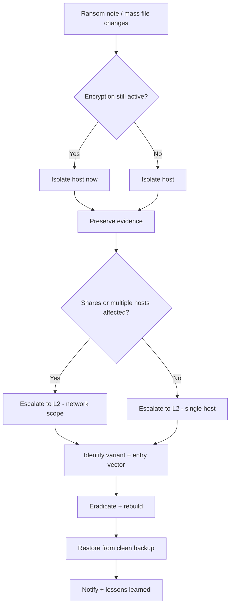

# Ransomware

**Status:** 0.1 (draft)

---

## 1. Trigger Criteria

Open this runbook when any of the following appear, alone or together:

- A ransom note or on-screen message demanding payment appears on a user's desktop or in affected folders.
- Files become inaccessible or corrupted, often renamed with an unusual extension (e.g. `.abc`, `.xyz`, `.locked`).
- A large number of files are modified in a very short time window on a workstation or network share.
- An EDR alert, antivirus detection, or SIEM correlation rule fires on encryption-like behavior.
- Users report unusual professional emails (often disguised as invoices) with attachments, shortly before symptoms appear.
- Unusual outbound connections are observed — Tor gateways, Tor/I2P addresses, or cryptocurrency payment sites.
- Privileged accounts show logons or lateral movement at unusual hours, just before symptoms appear.
- A ransomware operator's leak site or forum references your organization.

## 2. Time Objectives

- **L1:** contain the affected host(s) within < 30 min of trigger.
- **L2:** complete eradication within < 4 h of containment.

These are internal operational targets to challenge with real incident data — not regulatory deadlines.

## 3. Decision Tree

## 4. L1 Actions

1. **Confirm the signs.** Check for a ransom note, unusual file extensions, mass file changes in a short window, or an EDR/SIEM alert tied to encryption behavior.
   - **Dedicated tool**: EDR/SIEM alert console — pivot on the triggering detection.
   - **CLI / open-source alternative**: inspect the desktop and affected folders directly; on Windows, `Get-ChildItem -Recurse -Path <share> | Sort-Object LastWriteTime -Descending | Select-Object -First 50` to spot mass recent changes; on Linux, `find /path -mmin -15 -type f`.

2. **Isolate the affected host(s) from the network immediately — do not power them off.** Powering off destroys volatile memory evidence and can trigger destructive routines in some ransomware families.
   - **Dedicated tool**: EDR network isolation / quarantine action.
   - **CLI / open-source alternative**: disable the network adapter (`netsh interface set interface "<name>" admin=disable` on Windows, `ip link set <iface> down` on Linux) or physically unplug the network cable; leave the machine powered on.

3. **Protect shared drives and backups before they get encrypted too.** Disconnect or lock down shares reachable from the affected host, even ones not yet showing symptoms.
   - **Dedicated tool**: storage platform's share-lockdown feature, or EDR-integrated share protection.
   - **CLI / open-source alternative**: `net use x: \\unc\path\ /DELETE` to drop mapped drives from the affected host, or disable the share directly at the file server console.

4. **Preserve evidence before doing anything else destructive.** Photograph the ransom note and any on-screen message, note the encrypted-file extension and naming pattern, and record exact timestamps.
   - **Dedicated tool**: EDR forensic snapshot / triage collection.
   - **CLI / open-source alternative**: a smartphone photo of the screen, plus a memory capture with a free imaging tool (e.g., one compatible with Volatility) if it doesn't delay isolation.

5. **Disable accounts showing signs of compromise** — especially privileged accounts used at unusual hours, or accounts created around the time of the incident.
   - **Dedicated tool**: IAM/PAM console bulk account disable.
   - **CLI / open-source alternative**: `Disable-ADAccount -Identity <user>` (Active Directory PowerShell module), or lock the account directly in your directory service console.

6. **Escalate to L2 with what you have** — affected hosts/users, ransom note contents, file extension pattern, and a rough timeline. Do not negotiate, pay, or restore from backup at this stage.
   - **Dedicated tool**: your case-management/ticketing platform.
   - **CLI / open-source alternative**: TheHive, or a shared incident document — whatever your team already uses to hand off cases.

## 5. L2 Actions

1. **Identify the ransomware family/variant.** Use the ransom note content, the encrypted-file extension, and the contact method as fingerprints.
   - **Dedicated tool**: your EDR/AV vendor's sample-analysis service.
   - **CLI / open-source alternative**: submit an encrypted file and the ransom note to a free identification service such as ID Ransomware or the No More Ransom Project's Crypto Sheriff.

2. **Determine the full scope.** Hunt for the same indicators across the environment — hosts, accounts, shares.
   - **Dedicated tool**: EDR fleet-wide IOC sweep.
   - **CLI / open-source alternative**: write and run YARA rules against suspect hosts, or use Sysmon logs and Sysinternals tools (Autoruns, Process Explorer) to check similar systems by hand.

3. **Find the infection vector** — phishing attachment, exposed RDP, self-propagation, or delivery by another piece of malware already on the network.
   - **Dedicated tool**: email security gateway's forensic search, or EDR process-tree timeline.
   - **CLI / open-source alternative**: review mail server logs and firewall/VPN logs manually; check for exposed RDP with a basic scan of your own perimeter (e.g., `nmap`).

4. **Contain at network level.** Block command-and-control domains/IPs, isolate the affected VLAN or segment, and geo-filter if attacker infrastructure is concentrated in specific regions.
   - **Dedicated tool**: next-generation firewall policy push.
   - **CLI / open-source alternative**: manual firewall rule changes (`iptables`, pfSense/OPNsense ACLs), or a DNS sinkhole (e.g., Pi-hole, `unbound`) for the identified C2 domains.

5. **Eradicate.** Remove attacker binaries and persistence mechanisms, revert malicious configuration changes, and rebuild from known-clean media wherever you're not fully confident a host is clean.
   - **Dedicated tool**: EDR remediation actions (kill process, quarantine file, remove persistence).
   - **CLI / open-source alternative**: Sysinternals Autoruns to find and remove persistence entries; reimage from a known-clean OS image where in doubt.

6. **Recover.** Restore from backups you've verified are clean, onto hardened and patched systems, and reset credentials — especially administrator and other privileged accounts — before reconnecting anything.
   - **Dedicated tool**: backup platform's integrity-verified restore, combined with EDR confirmation that the target is clean before reconnect.
   - **CLI / open-source alternative**: manual restore plus an offline antivirus scan pass (e.g., ClamAV) before reconnecting; bulk credential reset via `Reset-ADAccountPassword` or your directory service's equivalent.

7. **Check for a known decryptor** before considering any other option for data you believe is unrecoverable.
   - **Dedicated tool**: a decryptor published by your EDR/AV vendor for the identified family, if one exists.
   - **CLI / open-source alternative**: the No More Ransom Project's Decryption Tools directory — free, community-maintained, no vendor account needed.

8. **Watch for reinfection and for data-leak publication** tied to this incident.
   - **Dedicated tool**: threat-intelligence / dark-web monitoring subscription.
   - **CLI / open-source alternative**: manually check public ransomware leak-site trackers, and temporarily raise alert priority on this incident's IOCs in your existing monitoring.

## 6. Notification & Escalation

> Notify your competent authority (national CERT, DPO, regulator) according to the regulations applicable in your jurisdiction — consult your legal counsel. See `finding-your-csirt.md` to identify who to contact.

## 7. Pitfalls to Avoid

- **Powering off the infected host** — destroys volatile evidence and can trigger destructive behavior in some ransomware families. Isolate instead of shutting down.
- **Restoring from a backup before verifying it's actually clean** — this just reinfects a freshly-rebuilt system.
- **Deleting or dismissing the ransom note before recording it** — you lose your best variant-identification clues.
- **Reconnecting a "cleaned" system to the network before confirming no persistence mechanism remains.**
- **Leaving shared drives and backup targets reachable from an infected host** while you investigate — that's often how the blast radius grows.
- **Treating containment as finished once the first host is isolated** — check for lateral movement and additional affected systems before declaring scope closed.
- **Deciding to pay the ransom without first exhausting free decryptor options** and understanding the operational reality: payment does not guarantee recovery, and does not prevent a repeat attack.

## 8. Resources

- MITRE ATT&CK [T1486](https://attack.mitre.org/techniques/T1486/) — Data Encrypted for Impact.
- MITRE ATT&CK [T1490](https://attack.mitre.org/techniques/T1490/) — Inhibit System Recovery (backup/shadow-copy deletion is a common ransomware behavior).
- MITRE ATT&CK [TA0001](https://attack.mitre.org/tactics/TA0001/) — Initial Access (check this tactic's techniques to find the infection vector).
- Tools cited as examples: YARA, DFIR-ORC (an open-source triage tool originally released by ANSSI), the Sysinternals Suite, Volatility, TheHive, the No More Ransom Project, ID Ransomware.

## 9. Sources of Inspiration

- CERT Société Générale — IRM #17 "Ransomware" (v2.0) — `github.com/certsocietegenerale/IRM` — CC BY 3.0 Unported.
- CERT aDvens — IRM-17 "Attaque par rançongiciel" (2025-10-27) — `github.com/cert-advens/IRM` — CC BY 3.0 Unported.
- Counteractive — "Playbook: Ransomware" — `github.com/counteractive/incident-response-plan-template` — Apache License 2.0.
