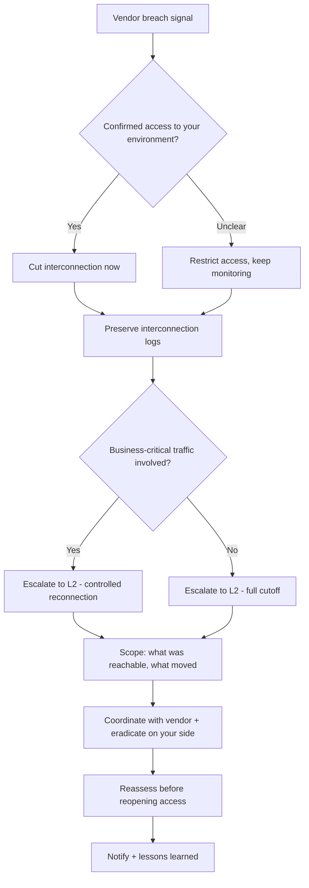

# Supply Chain / Third-Party Compromise

**Status:** 0.1 (draft)
{: .irf-status }

---

## 1. Trigger Criteria

Open this runbook when any of the following appear, alone or together:

- Threat intelligence, a leak site, or open-source reporting names one of your vendors, partners, or suppliers as breached.
- The third party itself notifies you of a security incident on their side.
- Unusual traffic patterns appear on an interconnection with a partner or vendor — unexpected volume, new destinations, or off-hours activity.
- A software update, library, or dependency from a supplier behaves unexpectedly shortly after installation — unauthorized network calls, unrecognized processes, or unexpectedly modified files.
- An account or credential belonging to a third party (support access, integration account, shared API key) shows signs of compromise or unusual use.
- A managed service provider or IT vendor with privileged access to your environment reports — or is suspected of — a breach.

## 2. Time Objectives

- **L1:** contain the affected interconnection or access within < 30 min of trigger.
- **L2:** complete scoping and eradication within < 4 h of containment.

These are internal operational targets to challenge with real incident data — not regulatory deadlines.

## 3. Decision Tree

## 4. L1 Actions

1. **Confirm the signal.** Cross-check the leak-site mention, threat-intel report, or the vendor's own notification against what access or interconnection that vendor actually has in your environment.
    - **Dedicated tool**: vendor/asset inventory or CMDB entry for the third party.
    - **CLI / open-source alternative**: a maintained spreadsheet or text file listing vendor accounts and interconnections — grep it for the vendor's name.

2. **Cut or suspend the interconnection immediately** if compromise is confirmed, or if business-critical access doesn't depend on staying connected. Don't wait for the vendor's own timeline.
    - **Dedicated tool**: firewall / network segmentation policy push (a pre-planned cutoff action).
    - **CLI / open-source alternative**: a manual firewall rule disabling the specific route, VPN tunnel, or IP range tied to the vendor (`iptables`, pfSense/OPNsense ACL), or disable the specific integration/API key directly.

3. **Disable any account, API key, or credential dedicated to that third party** — support access, integration account, or service account.
    - **Dedicated tool**: IAM/PAM console targeted disable.
    - **CLI / open-source alternative**: `Disable-ADAccount -Identity <account>`, or revoke the specific API key/token via the relevant service's admin console.

4. **If email is the interconnection point, quarantine or filter messages from the affected vendor's domain** rather than blocking it outright — you may still need their incident updates.
    - **Dedicated tool**: email security gateway rule (redirect to a sandboxed mailbox, strip attachments/links).
    - **CLI / open-source alternative**: a mail-server-side rule holding messages from the domain for manual review before delivery.

5. **Preserve logs of the interconnection** — traffic, authentication, and API-call logs — before they roll off retention.
    - **Dedicated tool**: SIEM export filtered to the vendor's source IPs/accounts.
    - **CLI / open-source alternative**: manually export the relevant firewall/VPN/API gateway logs to a timestamped file.

6. **Escalate to L2 with what you have** — which vendor, what access they had, and whether critical business traffic depends on staying connected.
    - **Dedicated tool**: your case-management/ticketing platform.
    - **CLI / open-source alternative**: TheHive, or a shared incident document.

## 5. L2 Actions

1. **Establish a direct communication channel with the vendor's security team**, outside your normal email if that channel itself might be affected.
    - **Dedicated tool**: your vendor's dedicated security/incident contact, from your vendor risk register.
    - **CLI / open-source alternative**: a phone call to a number you already had on file, or an out-of-band messaging channel.

2. **Determine the full scope of what the vendor could reach**: which systems, data, or credentials were exposed through that interconnection.
    - **Dedicated tool**: CMDB/asset inventory cross-referenced with access logs.
    - **CLI / open-source alternative**: manually cross-reference your firewall/VPN/API gateway logs against your own asset list.

3. **Hunt for indicators of lateral movement** from the vendor's access point into your own environment.
    - **Dedicated tool**: EDR/SIEM fleet-wide IOC sweep, using indicators shared by the vendor.
    - **CLI / open-source alternative**: YARA rules and Sysmon/Sysinternals review on hosts reachable from the vendor's access point.

4. **If the vendor supplies software, check whether you're running the compromised version**, and verify recent updates against known-good checksums or signatures before trusting them.
    - **Dedicated tool**: software composition analysis / SBOM management platform.
    - **CLI / open-source alternative**: free SBOM and dependency tools such as Syft and Grype, or `npm audit` / `pip-audit` for the affected package ecosystem; compare file hashes against the vendor's published checksums.

5. **Request a formal incident report and an up-to-date indicator list from the vendor**, and track their remediation transparency — treat a vendor that stops communicating as still-open risk.
    - **Dedicated tool**: vendor risk management platform's incident tracking.
    - **CLI / open-source alternative**: a shared incident document logging what the vendor has (and hasn't) confirmed, updated as you hear back.

6. **Coordinate joint containment** where the compromise sits on the vendor's side — you act on your side (disable, quarantine) while they act on theirs (revoke the attacker's access, rotate secrets).
    - **Dedicated tool**: a joint incident bridge/call with both security teams.
    - **CLI / open-source alternative**: a shared, timestamped incident log both sides can read and update.

7. **Before reopening the interconnection, verify with evidence — not just the vendor's assurance — that their environment is clean**, and rotate every credential or secret shared with them.
    - **Dedicated tool**: an independent security assessment of the restored connection before go-live.
    - **CLI / open-source alternative**: manually re-check the vendor's fix against the original indicators, and rotate API keys, passwords, and certificates yourself regardless of what they report.

8. **Reassess this vendor's risk profile and access scope going forward** — do they need the same level of access they had before?
    - **Dedicated tool**: vendor risk management platform's risk-score update.
    - **CLI / open-source alternative**: update your own vendor tracking spreadsheet with the incident and a reduced-access recommendation.

## 6. Notification & Escalation

> Escalate internally first — brief your SOC/IR lead and management with what you've confirmed and what's still uncertain. The decision to notify anyone outside your organization (a national CERT, a regulator, law enforcement) belongs to your organization's leadership and legal/DPO function, not to the responding analyst. See `finding-your-csirt.md` if your organization needs help identifying which external body to reach.

## 7. Pitfalls to Avoid

- **Trusting the vendor's "all clear" without independent verification** — their own detection gap may be why they got breached in the first place.
- **Reopening the interconnection without rotating every shared credential or secret** — an attacker with vendor-side access may have copied them.
- **Fully blocking all vendor communication, including email, when you still need their incident updates** — filter or quarantine instead of cutting every channel.
- **Treating this as solely the vendor's problem** — if they had access to your environment, you need to scope your own side regardless of fault.
- **Waiting for a formal report before taking any containment action** — cut or restrict access on suspicion, tighten further once confirmed.
- **Assuming a compromised software update only affects the system where you first noticed something odd** — check every system running that vendor's software, not just the one that triggered the alert.

## 8. Resources

- MITRE ATT&CK [T1195](https://attack.mitre.org/techniques/T1195/) — Supply Chain Compromise (T1195.001 Compromise Software Dependencies and Development Tools, T1195.002 Compromise Software Supply Chain, T1195.003 Compromise Hardware Supply Chain).
- MITRE ATT&CK [T1199](https://attack.mitre.org/techniques/T1199/) — Trusted Relationship.
- Tools cited as examples: Syft, Grype, OWASP Dependency-Check, `npm audit`, `pip-audit`, TheHive, MISP.

## 9. Sources of Inspiration

- CERT Société Générale — IRM #19 "Third-Party Compromise" (v1.0) — `github.com/certsocietegenerale/IRM` — CC BY 3.0 Unported.
- CERT aDvens — IRM-19 "Compromission d'un tiers" (2025-10-27) — `github.com/cert-advens/IRM` — CC BY 3.0 Unported.
