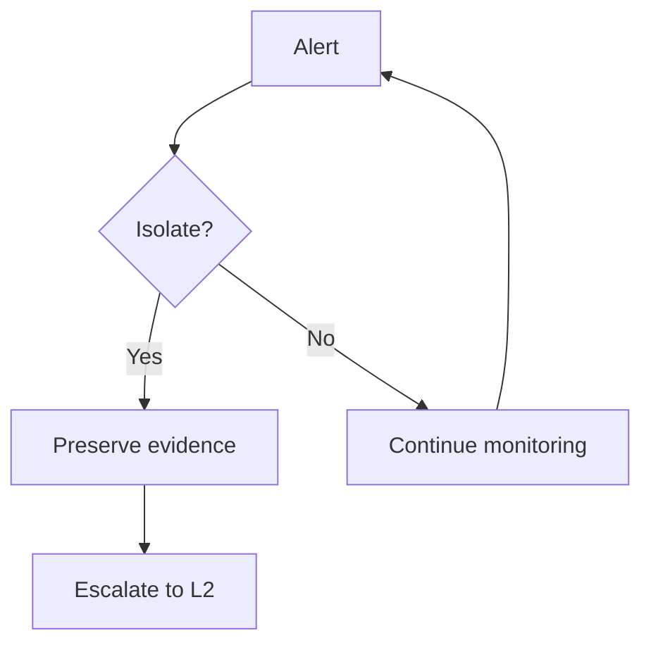

# Runbook Template

> Copy this file to `docs/runbooks/<scenario>.md` **and** its mirror to
> `docs/fr/runbooks/<scenario>.md` when starting a new runbook. Keep the same
> nine sections, in the same order, worded to the same level of detail, in
> both languages — a runbook is not delivered until both exist.
>
> Before writing content: a new runbook's status is **0.x (draft)**. It only
> becomes **v1.0 (validated)** once a `real-world-tested` Issue is closed
> against it — never set that status yourself.

**Status:** 0.1 (draft)

---

## 1. Trigger Criteria

List the concrete, observable signals that mean "open this runbook" — alert
types, user reports, log patterns. Be specific enough that an analyst can
self-diagnose which runbook applies without guessing.

## 2. Time Objectives

State the internal operational targets for this scenario, e.g.:

- **L1:** contain within < 30 min of trigger.
- **L2:** eradicate within < 4 h of containment.

These are working targets for the team to challenge with real data — not
regulatory deadlines. Never phrase this section as a legal or contractual
obligation.

## 3. Decision Tree

Use short, neutral Mermaid labels, identical in the English and French
versions of this runbook — never maintain two different diagrams.

## 4. L1 Actions

Numbered, ordered by priority. **Every** technical action must give both
options — an analyst with no EDR or commercial SIEM must be able to complete
100% of the runbook on the free/open-source column alone:

1. **Action name** — what to do and why it matters right now.
   - **Dedicated tool** (e.g., CrowdStrike, SentinelOne, Splunk): concrete
     step using that tool.
   - **CLI / open-source alternative** (e.g., `tasklist`, `netstat`,
     Sysinternals, Volatility): concrete step achieving the same result.

## 5. L2 Actions

Same numbered format and the same Dedicated tool / CLI-open-source pattern as
section 4, covering investigation and eradication steps.

1. **Action name** — investigation or eradication step.
   - **Dedicated tool** (e.g., ...): ...
   - **CLI / open-source alternative** (e.g., ...): ...

## 6. Notification & Escalation

Use this exact generic wording (translated, never with a number added) —
do not name a specific authority or a notification deadline:

> Notify your competent authority (national CERT, DPO, regulator) according
> to the regulations applicable in your jurisdiction — consult your legal
> counsel. See `finding-your-csirt.md` to identify who to contact.

## 7. Pitfalls to Avoid

What destroys evidence or makes the incident worse — e.g., premature shutdown
of a compromised host, restoring from a tainted backup before root-causing.

## 8. Resources

References only — this is the one section (with §9) allowed to name external
bodies or standards:

- MITRE ATT&CK techniques relevant to this scenario (e.g., `T1486` for
  ransomware).
- Tools cited as examples (open-source project names, not vendor pitches).

## 9. Sources of Inspiration

Cite every source actually consulted while researching this runbook, with
its license. Method: consult → synthesize → write original text — never
copy a source paragraph verbatim.

- Source name — URL — license.
